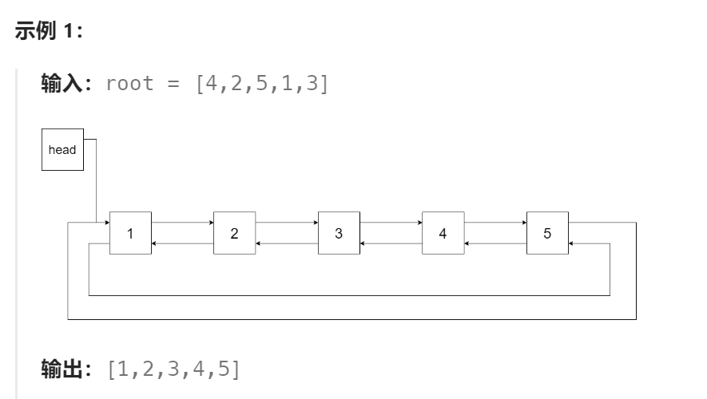

题目：

将一个 **二叉搜索树** 就地转化为一个 **已排序的双向循环链表** 。

对于双向循环列表，你可以将左右孩子指针作为双向循环链表的前驱和后继指针，第一个节点的前驱是最后一个节点，最后一个节点的后继是第一个节点。

特别地，我们希望可以 **就地** 完成转换操作。当转化完成以后，树中节点的左指针需要指向前驱，树中节点的右指针需要指向后继。还需要返回链表中最小元素的指针。



题解：

**注意：此题不能使用`285.二叉搜索树中的中序后继`中的方法为每个节点寻找前驱节点和后继节点，这样的方式会严重超时。**

此题使用了一种新的方式：每个节点只获取自己的前驱节点，然后修改前驱节点与当前节点为双向链表关系。

需要注意到：题目`285`是在二叉树中获取**任意一个节点的后继(前驱)节点**，而此题则是为**每一个节点获取其前驱**，然后修改关系。

为此，我们可以直接使用中序遍历BST的获取，获取每个节点的前驱：

```go
func helper(root *Node, head **Node, pre **Node) {
    // 左子树修改为链表,此时的last指向左子树的最大(右)节点(因为采取中序遍历BST)
    helper(root.Left, head, pre)

    if *pre == nil {   // pre == nil 仅当 root 为最左侧节点时才会发生,因为该节点没有前驱
        *head = root   // 最左侧节点将成为链表头
    } else {
        (*pre).Right = root   // 仅当pre存在时,pre的后继为当前节点
    }
    root.Left = *pre	// 设置当前节点的前驱为pre(可以为nil)
    *pre = root		// 更新pre为子树根节点提供给右子树使用，右子树的最小节点会以此为前驱

	// 右子树修改为链表,右子树的最小(左)节点会以last为前驱
    helper(root.Right, head, pre) 
}
```

```go
func treeToDoublyList(root *Node) *Node {
    if root==nil {
        return nil
    }
    var head *Node = nil   // 最终指向链表头
    var pre *Node = nil     // 最终指向链表尾

    helper(root,&head,&pre)

    head.Left = pre
    pre.Right = head
    
    return head
}

// head和pre必须是双重指针,因为存储的对象值类型就是*Node
func helper(root *Node, head **Node, pre **Node) {
    if root == nil {
        return
    }

    helper(root.Left, head, pre)

    if *pre == nil {   // pre == nil 仅当 root 为最左侧节点时才会发生,因为该节点没有前驱
        *head = root   // 最左侧节点将成为链表头
    } else {
        (*pre).Right = root   // 仅当pre存在时
    }
    root.Left = *pre
    *pre = root


    helper(root.Right, head, pre)   
}
```

