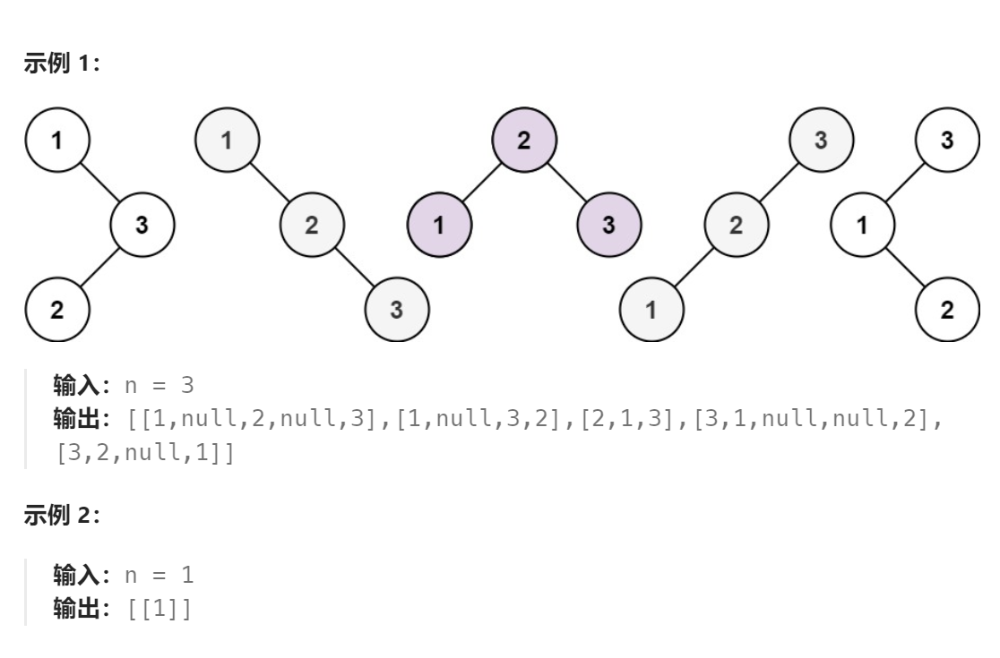

问题：

给你一个整数 `n` ，请你生成并返回所有由 `n` 个节点组成且节点值从 `1` 到 `n` 互不相同的不同 **二叉搜索树** 。可以按 **任意顺序** 返回答案。



题解：

```go
/**
 * Definition for a binary tree node.
 * type TreeNode struct {
 *     Val int
 *     Left *TreeNode
 *     Right *TreeNode
 * }
 */
func generateTrees(n int) []*TreeNode {
    if n == 0 {
        return nil
    }
    return createBST(1,n)
}

// 节点可以从min~max范围内取值
func createBST(min,max int) []*TreeNode {
    if min > max {  
        return []*TreeNode{nil}
    }
    allBSTree := make([]*TreeNode,0)  // 存储所有可能的BST

    for i:=min;i<=max;i++ {   // 头结点依次取 min~max
        // root := &TreeNode{i,nil,nil}   root的创建不能放到这，原因是其为地址型而非值类型
        leftBSTSet := createBST(min,i-1) // 左子树上的节点只能从 min~i-1范围内取值
        rightBSTSet := createBST(i+1,max) // 右子树上的只能从 i+1~max范围内取值

        // 每次从leftBSTSet和rightBSTSet中各取一个进行组合
        for left :=0;left <len(leftBSTSet);left++ {
            for right :=0;right <len(rightBSTSet);right++ {
                root := &TreeNode{i,nil,nil}   // root的创建需要在这，每次都创建一个新的，而非复用上面的
                root.Left = leftBSTSet[left]
                root.Right = rightBSTSet[right]
                allBSTree = append(allBSTree,root)
            }
        } 
    }
    return allBSTree
}
```

