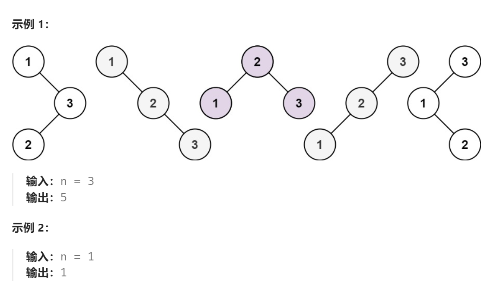
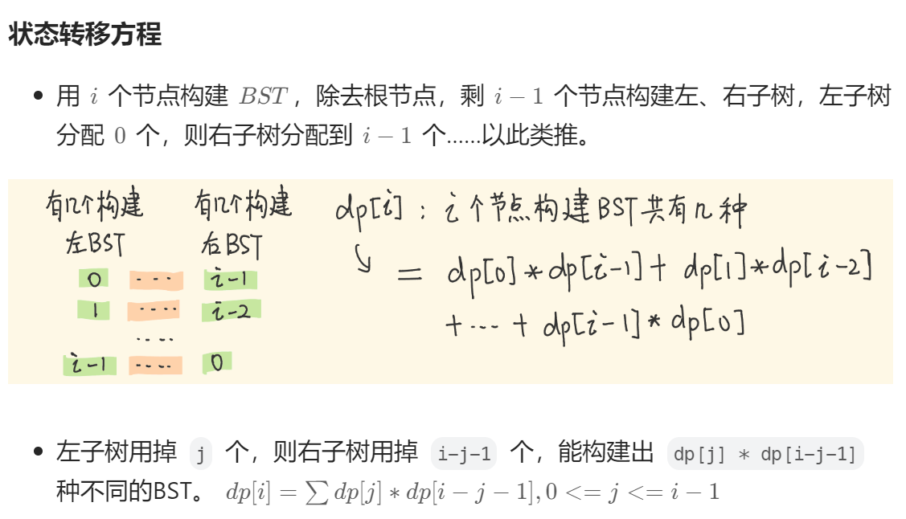

题目：给你一个整数 `n` ，求恰由 `n` 个节点组成且节点值从 `1` 到 `n` 互不相同的 **二叉搜索树** 有多少种？返回满足题意的二叉搜索树的种数。



解法：

动态规划（采用递归会超时）



```go
func numTrees(n int) int {  
    dp := make([]int,n+1)   // 用总结点个数作为动态规划索引值
	// 1.初始条件
    dp[0] = 1   // 总节点个数为0时，只有空树一种可能
    dp[1] = 1   // 总结点个数为1时，只有一种BST
	// 2.状态转移方程
    for total:=2;total<=n;total++ {   // 从下往上，分别求总节点个数为 2~n时BST的总数
        for left:=0;left<=total-1;left++ {  // 左子树节点个数分别为 0~total-1 中一个
            dp[total] += dp[left] * dp[total-left-1]   // BST个数 = 左子树BST个数*右子树BST个数
        }
    }
	// 3.目标求解值
    return dp[n]
}
```


```go
func numTrees(n int) int {
    // dp[i]表示: 长度为 i 时的BST个数
    dp := make([]int,n+1)
    // base case: 长度为0，表示的是整棵树是空树，个数为1
    dp[0] = 1   
    // base case: 长度为1，BST个数为1
    dp[1] = 1   

    // 枚举 BST 的节点数量 (2~n)
    for count := 2; count <= n; count++ { 
        // 枚举 BST 根节点的取值 (1~count)
        for root := 1; root <= count; root++ { 
            // 根节点 == root情况下
            // 左子树有 root-1个节点(1 ~ root-1)，右子树有 count-root个节点(root+1 ~ count) 
            dp[count] += dp[root-1] * dp[count-root]  
        }
    }
    // 返回长度为i时的所有BST个数
    return dp[n]
}
```

