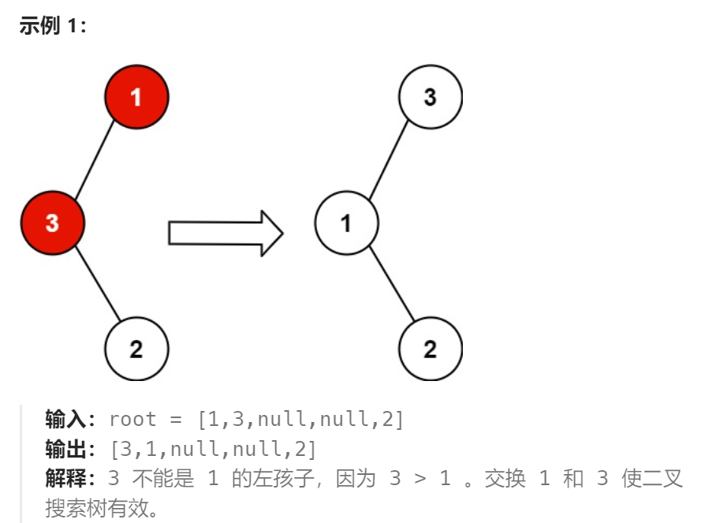
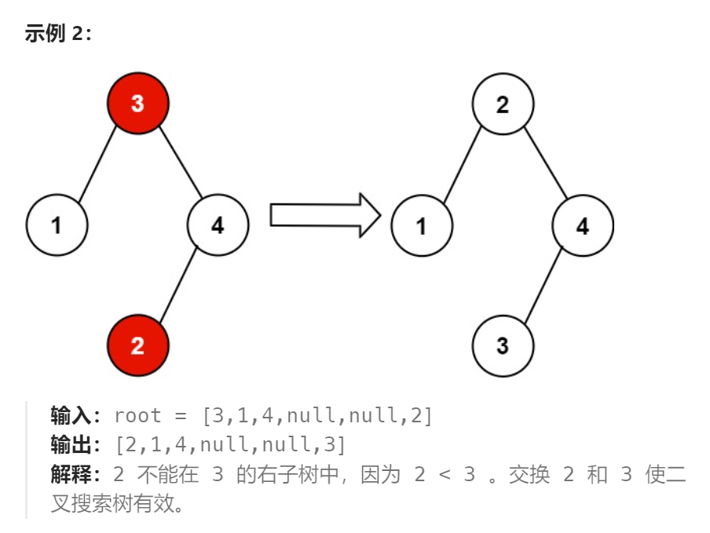

题目：

给你二叉搜索树的根节点 `root` ，该树中的 **恰好** 两个节点的值被错误地交换。*请在不改变其结构的情况下，恢复这棵树* 。





题解：

我们需要考虑两个节点被错误地交换后对原二叉搜索树造成了什么影响。对于二叉搜索树，我们知道如果对其进行中序遍历，得到的值序列是递增有序的，而如果我们错误地交换了两个节点，等价于在这个值序列中交换了两个值，破坏了值序列的递增性。

我们来看下如果在一个递增的序列中交换两个值会造成什么影响。

假设有一个递增序列 a=[1,2,3,4,5,6,7]。

如果我们交换两个**不相邻的数字**，例如 2 和 6。原序列变成了 a=[1,6,3,4,5,2,7]，那么显然序列中有两个位置不满足 a(i)<a(i+1)。在这个序列中体现为 6>3，5>2，因此只要我们找到这两个位置，即可找到被错误交换的两个节点。

如果我们交换两个**相邻的数字**，例如 2 和 3，此时交换后的序列只有一个位置不满足 a(i)<a(i+1)。

因此整个值序列中不满足条件的位置**或者有两个，或者有一个**。

```go
func recoverTree(root *TreeNode)  {
    nums := []int{}
    var inorder func(node *TreeNode)
    inorder = func(node *TreeNode) {
        if node == nil {
            return
        }
        inorder(node.Left)
        nums = append(nums, node.Val)
        inorder(node.Right)
    }
    inorder(root)    // 二叉树按照中序遍历输出
    x, y := findTwoSwapped(nums)   // 找到两个交换了位置的节点的值
    recover(root, 2, x, y)   // 在二叉树中进行恢复
}

func findTwoSwapped(nums []int) (int, int) {
    index1, index2 := -1, -1
    for i := 0; i < len(nums) - 1; i++ {
        if nums[i + 1] < nums[i] {
            // 如果是相邻值交换index2只会赋值一次;否则index2会赋值两次(第二个交换数的下标)
            // index2之所以为 i+1 是有原因的：
            // 1.如果是两个相邻的数字交换了位置，index2恰好就是与index1交换位置的
            // 2.如果是非相邻数字，index2也恰好是与index1交换位置的
            index2 = i + 1    
            if index1 == -1 {
                index1 = i   // index1只会赋值一次(第一个交换数的下标)
            } else {  // 第二次不会记录,而是直接退出
                break
            }
        }
    }
    x, y := nums[index1], nums[index2]
    return x, y
}

func recover(root *TreeNode, count, x, y int) {
    if root == nil {
        return
    }
    if count == 0 {   // count的作用是加快递归退出速度(一旦完成两个节点值的交换就可以立即退出了)
        return
    }
    
    if root.Val == x || root.Val == y {
        if root.Val == x {
            root.Val = y
        } else {
            root.Val = x
        }
        count--
        
    }
    recover(root.Right, count, x, y)
    recover(root.Left, count, x, y)
}
```

