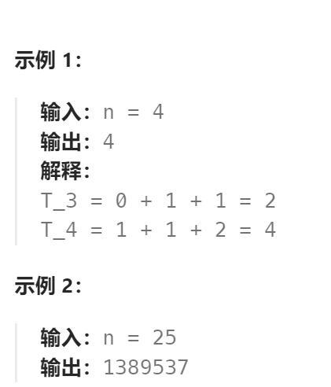

题目：

泰波那契序列 Tn 定义如下： 

T0 = 0, T1 = 1, T2 = 1, 且在 n >= 0 的条件下 Tn+3 = Tn + Tn+1 + Tn+2

给你整数 `n`，请返回第 n 个泰波那契数 Tn 的值。



题解：

- 标准动态规划解法

```go
func tribonacci(n int) int {
    if n == 0 {
        return 0
    }
    if n == 1 || n == 2 {
        return 1
    }
    dp:=make([]int, n+1)
    dp[0], dp[1], dp[2] = 0,1,1

    for i:=3; i<=n; i++ {
        dp[i] = dp[i-1] + dp[i-2] + dp[i-3]
    }
    return dp[n]
}
```

- 空间优化的动态规划解法

```go
func tribonacci(n int) int {
    if n == 0 {
        return 0
    }
    if n == 1 || n == 2 {
        return 1
    }
    ago0, ago1, ago2 := 0,1,1
    
    for i:=3; i<=n; i++ {
        ago2Tmp := ago2
        ago1Tmp := ago1
        ago2 = ago0 + ago1 + ago2   // 新计算出的第三个数
        ago1 = ago2Tmp   // 新的第二个数等于之前的第三个数
        ago0 = ago1Tmp  // 新的第一个数等于之前的第二个数
    }
    return ago2
}
```

