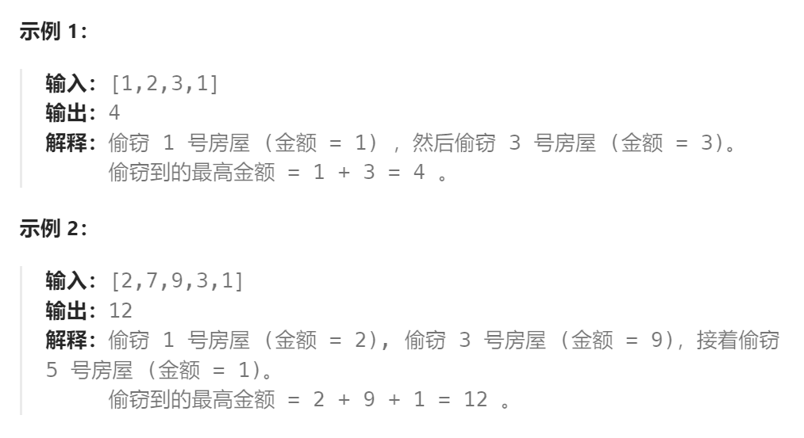

题目：

你是一个专业的小偷，计划偷窃沿街的房屋。每间房内都藏有一定的现金，影响你偷窃的唯一制约因素就是相邻的房屋装有相互连通的防盗系统，**如果两间相邻的房屋在同一晚上被小偷闯入，系统会自动报警**。

给定一个代表每个房屋存放金额的非负整数数组，计算你 **不触动警报装置的情况下** ，一夜之内能够偷窃到的最高金额。



题解：


```go
func rob(nums []int) int {
    if len(nums) == 1 {
        return nums[0]
    }
    if len(nums) == 2 {
        return getMax(nums[0], nums[1])
    }
    n := len(nums)-1  // 当到达n时，意味着走完了所有房屋

    // dp[i]的含义：当走到第i个房屋时，累积可以窃取到的最高金额
    dp := make([]int, len(nums))
    dp[0] = nums[0]   // 只有一个房屋时，最大金额就是这个房屋内的金额
    dp[1] = getMax(nums[0], nums[1])  // 有两个房屋时，选择窃取金额最高的那一个房屋

    for i:=2; i<=n; i++ {
        // 当走到第 i 个房屋时，此时偷窃的金额有两种来源：
        // 1.没有偷窃上一个房屋，那么可以在dp[i-2]的基础上，加上当前房屋的金额
        // 2.偷窃了上一个房屋，当前房屋就无法窃取，那么只能是dp[i-1]
        dp[i] = getMax(dp[i-2] + nums[i], dp[i-1])
    }
    return dp[n]
}
func getMax(a, b int) int {
    if a > b {
        return a
    } else {
        return b
    }
}
```

