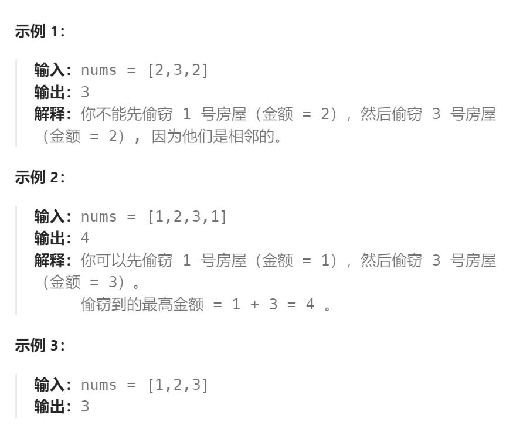

题目：

你是一个专业的小偷，计划偷窃沿街的房屋，每间房内都藏有一定的现金。这个地方所有的房屋都 **围成一圈** ，这意味着第一个房屋和最后一个房屋是紧挨着的。同时，相邻的房屋装有相互连通的防盗系统，**如果两间相邻的房屋在同一晚上被小偷闯入，系统会自动报警** 。

给定一个代表每个房屋存放金额的非负整数数组，计算你 **在不触动警报装置的情况下** ，今晚能够偷窃到的最高金额。



题解：

动态规划讲究一个**无后效性**，如果此题直接按照`打家劫舍`一模一样的方式直接求显然不行，因为**第一个房屋是否窃取会影响后面的最后一个房屋是否窃取**，也就是前面的选择会影响后面的选择。

为了避免上述**前面的选择会影响后面的选择**这种问题的出现，我们硬性的**将问题分解，保证分解后每一个问题都满足无后效性**，然后根据这些子问题再结合获取最优答案：

- `dp[i][0]`: 第一个和最后一个屋子都不偷（必须不偷），能获得的最大利润
- `dp[i][1]`: 必须偷第一个屋子，必须不偷最后一个屋子的时候，能获得的最大利润
- `dp[i][2]`: 必须不偷第一个屋子，必须偷最后一个屋子的时候，能获得的最大利润

这样每个子问题都是无后效性的，从上述三个子问题各自的最优答案中再选优，获取最终的答案。

```go
func rob(nums []int) int {
    if len(nums) == 1 {
        return nums[0]
    }
    if len(nums) == 2 {
        return getMax(nums[0], nums[1])
    }
    n := len(nums)
    // dp[i]表示：走到第i个房屋时，能获得的最大金额
    dp := make([][3]int, n)
    // dp[i][0]: 第一个和最后一个屋子都不偷（必须不偷），能获得的最大利润
    // dp[i][1]: 必须偷第一个屋子，必须不偷最后一个屋子的时候，能获得的最大利润
    // dp[i][2]: 必须不偷第一个屋子，必须偷最后一个屋子的时候，能获得的最大利润

    // base case:
    dp[0][0], dp[0][1], dp[0][2] = 0, nums[0], 0
    dp[1][0], dp[1][1], dp[1][2] = nums[1], nums[0], nums[1]

    for i := 2; i < n; i++ {
        if i == n-1 {   // 走到了最后一个屋子
            dp[i][0] = dp[i-1][0]   // 必须不偷
            dp[i][1] = dp[i-1][1]   // 必须不偷
            dp[i][2] = dp[i-2][2] + nums[i]  // 必须偷
            break
        }
        // 其他屋子，照常使用最高利润的状态转移方程求
        dp[i][0] = getMax(dp[i-2][0] + nums[i], dp[i-1][0])
        dp[i][1] = getMax(dp[i-2][1] + nums[i], dp[i-1][1])
        dp[i][2] = getMax(dp[i-2][2] + nums[i], dp[i-1][2])
    }
    return getMax(dp[n-1][0], getMax(dp[n-1][1], dp[n-1][2]))
}
func getMax(a, b int) int {
    if a > b {
        return a
    } else {
        return b
    }
}
```

