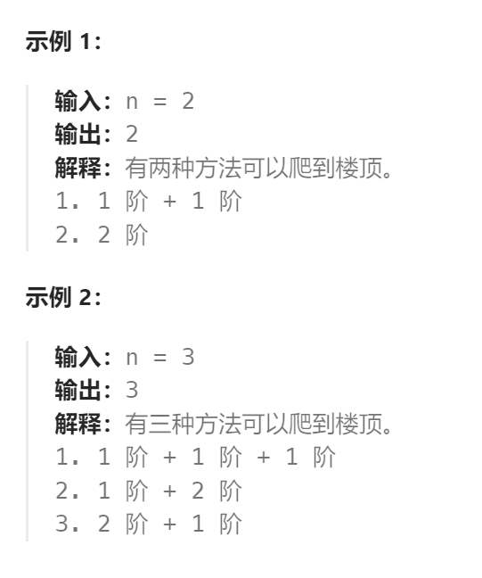

题目：

假设你正在爬楼梯。需要 `n` 阶你才能到达楼顶。

每次你可以爬 `1` 或 `2` 个台阶。你有多少种不同的方法可以爬到楼顶呢？



题解：

1. `base case`：dp[1] = 1    dp[2] = 2
2. 状态量：当且到达的楼梯阶数 i 
3. 选择：每次都可以选择爬 1 或 2 个台阶
4. `dp[i]`的含义：到达楼梯阶数 i 的不同方法数

```go
func climbStairs(n int) int {
    if n == 1 {
        return 1
    } 
    if n == 2 {
        return 2
    }

    dp := make([]int, n+1)  // dp[0]不使用
    dp[1] = 1
    dp[2] = 2

    for i:=3; i<len(dp); i++ {
        // 到达第 i 阶，有两种方式：
        // 方式一：在第 i-1 阶上，再走一个台阶
        // 方式二：在第 i-2 阶上，再走两个台阶
        // 因为每次只能走1或2个台阶，因此只有这两种方式
        dp[i] = dp[i-1] + dp[i-2]   
    }
    return dp[n]
}
```

因为**每次的 dp[i] 仅依赖于两个状态**，因此可以进一步优化空间复杂度，无需保证O(N)的 dp[] 数组，而是每次仅保留**两个常数空间变量**即可

```go
func climbStairs(n int) int {
    if n == 1 {
        return 1
    } 
    if n == 2 {
        return 2
    }

    agoStep1 := 1
    agoStep2 := 2

    for i:=3; i<=n; i++ {
        tmp := agoStep2
        agoStep2 = agoStep1 + agoStep2
        agoStep1 = tmp
    }
    return agoStep2
}
```

