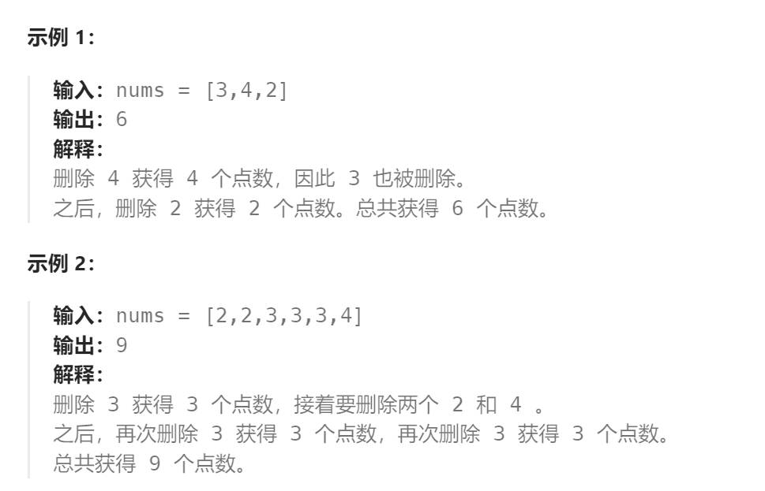

题目：

给你一个整数数组 `nums` ，你可以对它进行一些操作。

每次操作中，选择任意一个 `nums[i]` ，删除它并获得 `nums[i]` 的点数。之后，你必须删除 **所有** 等于 `nums[i] - 1` 和 `nums[i] + 1` 的元素。

开始你拥有 `0` 个点数。返回你能通过这些操作获得的最大点数。



题解：

- 状态量：当前获取的点数
- 选择：每次可以从`nums[]`中选择的不同大小的数值

此题的要求是：**相邻数值不能同时选择**，类似于打家劫舍的"**相邻房屋不能同时抢劫**"。

因此，如果将动态规划中`dp[i]`的**下标`i`的物理意义设置成数值**，即可将**该题转化成打家劫舍问题**。

```go
func deleteAndEarn(nums []int) int {
    maxVal := math.MinInt   // 获取nums[]中的最大元素值
    valueMap := make(map[int]int)   // 统计每个数值在nums[]中的出现次数
    for i:=0; i<len(nums); i++ {
        if nums[i] > maxVal {
            maxVal = nums[i]
        }
        valueMap[nums[i]]++
    }
    // dp[i]的意义: 删除数字i（部分数字可以不存在于nums[]中，相当于出现次数为0）后能获取的最大点数
    // i表示的是数值，最小是1，最大是nums[]中的最大值
    dp := make([]int, maxVal+1)
    dp[1] = 1*valueMap[1]   // 如果nums[]中原本含有数字1，那么删除数字1可以获得所有1的贡献之和
    dp[2] = getMax(dp[1], 2*valueMap[2])   // 选择点数最大的一种可能(删除数值1或者删除数值2)   

    for i:=2; i<=maxVal; i++ {
        // dp[i]的点数来自两种计算途径:
        // 1.因为删除了i-1，导致当前i也没有了，dp[i] = dp[i-1]
        // 2.没有删除i-1, 当前i可以删除, dp[i] = dp[i-2] + i*valueMap[i] 
        // (如果i不存在于原始数组，那么dp[i-2] + i*valueMap[i] == dp[i-2])
        dp[i] = getMax(dp[i-1], dp[i-2] + i*valueMap[i])
    }
    return dp[maxVal]  // 遍历了所有可能的数值
}

func getMax(a,b int) int {
    if a > b {
        return a
    } else {
        return b
    }
}
```

