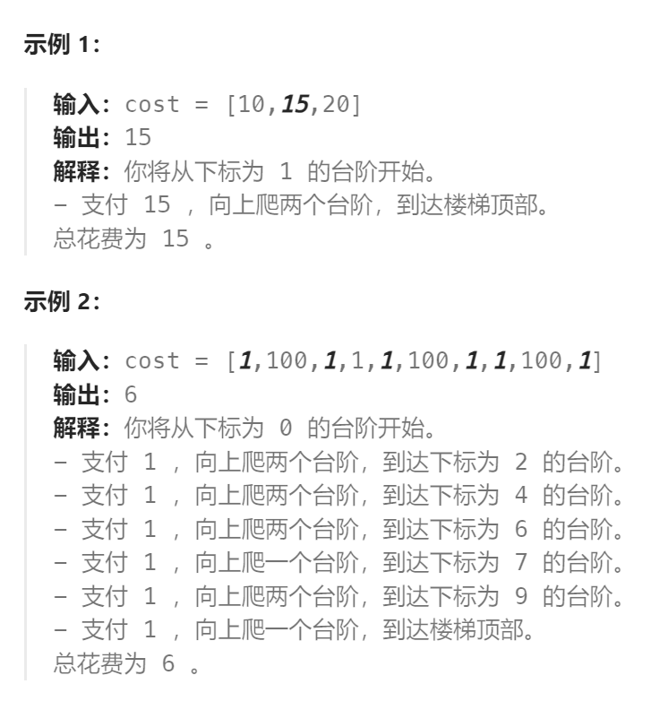

题目：

给你一个整数数组 `cost` ，其中 `cost[i]` 是从楼梯第 `i` 个台阶向上爬需要支付的费用。一旦你支付此费用，即可选择向上爬一个或者两个台阶。

你可以选择从下标为 `0` 或下标为 `1` 的台阶开始爬楼梯。

请你计算并返回达到楼梯顶部的最低花费。



题解：

```go
func minCostClimbingStairs(cost []int) int {
    n := len(cost)   // 当到达n的时候，意味着爬到了楼顶

    // dp[i] 的含义：表示到达第 i 个台阶时，花费的最低累计费用
    dp := make([]int, n+1)   // 最小在第0台阶，最大在第n台阶（楼顶）
    
    // 初始必须位于第0台阶或者第1台阶, 因为还没有向上爬,因为花费的累计金额都是0
    dp[0] = 0
    dp[1] = 0

    for i:=2; i<=n; i++ {
        // 到达第i台阶只有两种方式:
        // 1.在第i-1台阶向上走一步, 额外支付在i-1台阶上爬的费用
        // 2.在第i-2台阶向上走两步, 额外支付在i-2台阶上爬的费用
        // 从两种方式中选择花钱最少的一种方式
        dp[i] = getMin(dp[i-1] + cost[i-1], dp[i-2] + cost[i-2])
    }
    return dp[n]
}

func getMin(a,b int) int {
    if a < b {
        return a
    } else {
        return b
    }
}
```

