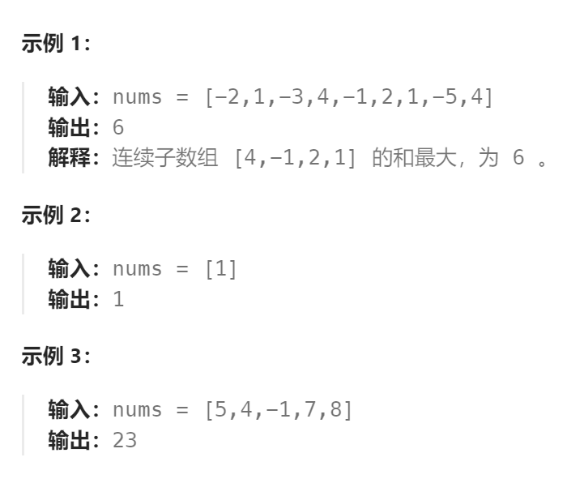

题目：

给你一个整数数组 `nums` ，请你找出一个具有最大和的连续子数组（子数组最少包含一个元素），返回其最大和。

**子数组** 是数组中的一个连续部分。



题解：

**注意：要将这个题与最长递增子序列问题的解法相区别，因为子数组必须是连续的，如果`dp[i]`的定义依旧是 `nums[0:i]` 中任意几个数组成的子序列的最大乘积是不对的，因为不能保证这个子序列中所有元素在`nums[]`中是连续的。**

正确的解法如下：

`dp[i]`表示以 `nums[i]` 作为结尾数的子数组的最大和，也就是**必须选择`nums[i]`**

```go
func maxSubArray(nums []int) int {
    n := len(nums)
    // dp[i]表示: 以 nums[i] 作为结尾数的子数组的最大和
    dp := make([]int, n)
    // base case: nums[0] 前面没有任何子数组，只有自己
    dp[0] = nums[0]

    for i := 1; i < n; i++ {
        // 以 nums[i] 作为结尾: 1.另起炉灶，重新创建以 nums[i] 起始的子数组 2.继承之前的子数组的最大和
        dp[i] = getMax(nums[i], dp[i-1] + nums[i])
    }
    // 不是直接返回 dp[n-1]，而是选择其中最大的一个
    maxVal := math.MinInt
    for i := range dp {
        if dp[i] > maxVal {
            maxVal = dp[i]
        }
    }
    return maxVal
}

func getMax(a, b int) int {
    if a > b {
        return a
    } else {
        return b
    }
}
```

