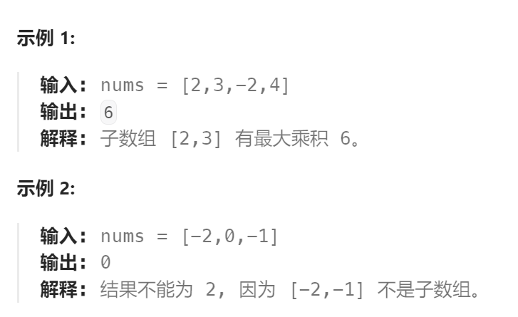

题目：

给你一个整数数组 `nums` ，请你找出数组中乘积最大的非空连续子数组（该子数组中至少包含一个数字），并返回该子数组所对应的乘积。

测试用例的答案是一个 **32-位** 整数。

**子数组** 是数组的连续子序列。



题解：

这个题不能直接使用`最大子数组和`的解法。

因为**状态转移方程不满足最优子结构**：`dp[i] = getMax(nums[i], dp[i-1] * nums[i])`

这是因为乘法和正负性的关系，上一个最大的 `dp[i-1]`也许因为乘了`nums[i]`反而不是最大的，而上一个最小的 `dp[i-1]`也许因为乘了`nums[i]`反而变成了最大的。

因此我们需要：**根据正负性进行分类讨论。**

1. 如果当前位置是一个负数的话，那么我们希望以它前一个位置结尾的某个段的积也是个负数，这样就可以负负得正，并且我们希望这个积尽可能「负得更多」，即尽可能小。
2. 如果当前位置是一个正数的话，我们更希望以它前一个位置结尾的某个段的积也是个正数，并且希望它尽可能地大。

为此，我们需要分别计算在不同的`i`下，**最大的子数组乘积**和**最小的子数组乘积**。

```go
func maxProduct(nums []int) int {
    n := len(nums)
    // dp[i]表示: 以 nums[i] 作为结尾的子数组的最大乘积
    dp := make([][2]int, n)
    // dp[i][0]: 保存以 nums[i] 作为结尾，最大的乘积
    // dp[i][1]: 保存以 nums[i] 作为结尾，最小的乘积
    // base case:
    dp[0][0], dp[0][1] = nums[0], nums[0]

    for i := 1; i < n; i++ {
        if nums[i] > 0 {   // 当前数是一个正数
            // 隐藏关系: dp[i-1][0] * nums[i] > dp[i-1][1] * nums[i] (两边同乘以一个正数, 大小关系不变)
            dp[i][0] = getMax(nums[i], dp[i-1][0] * nums[i])  
            dp[i][1] = getMin(nums[i], dp[i-1][1] * nums[i])
        } else if nums[i] == 0 {  // 当前数是0
            dp[i][0], dp[i][1] = 0,0
        } else {   // 当前数是负数
            // 隐藏关系: dp[i-1][0] * nums[i] < dp[i-1][1] * nums[i] (两边同乘以一个负数, 大小关系逆转)
            dp[i][0] = getMax(nums[i], dp[i-1][1] * nums[i])
            dp[i][1] = getMin(nums[i], dp[i-1][0] * nums[i])
        }
    }
    maxVal := math.MinInt
    for i := range dp {
        if dp[i][0] > maxVal {
            maxVal = dp[i][0]
        }
    }
    return maxVal
}
```

