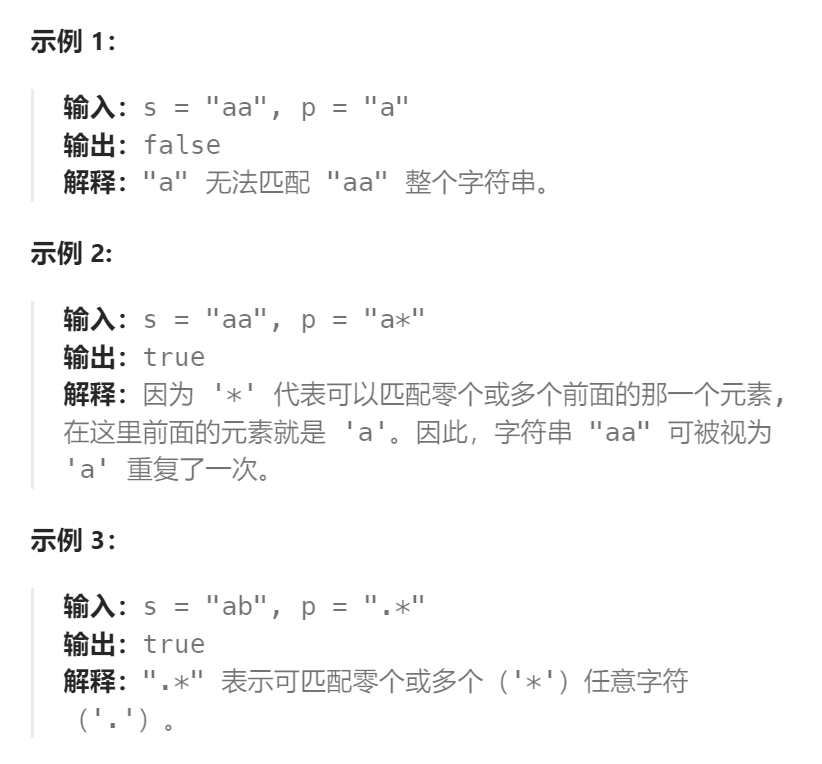
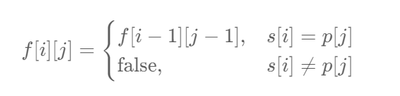
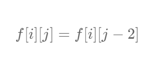
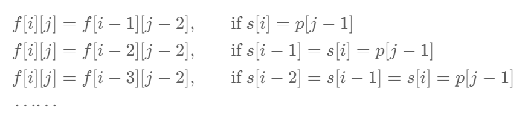
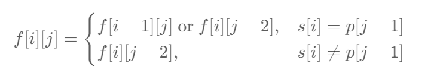
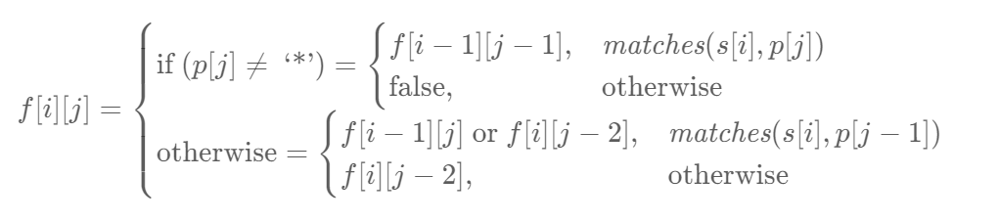

题目：

给你一个字符串 `s` 和一个字符规律 `p`，请你来实现一个支持 `'.'` 和 `'*'` 的正则表达式匹配。

- `'.'` 匹配任意单个字符
- `'*'` 匹配零个或多个前面的那一个元素

所谓匹配，是要涵盖 **整个** 字符串 `s`的，而不是部分字符串。



题解：

思路：我们每次从字符串 p 中取出**一个字符**或者**「字符 + 星号」的组合**，并在 s 中进行匹配。

- 对于 p 中**一个字符**而言，它只能在 s 中匹配一个字符，匹配的方法具有唯一性；
- 而对于 p 中**字符 + 星号的组合**而言，它可以在 s 中匹配任意自然数个字符，并不具有唯一性。

因此我们可以考虑使用动态规划，对匹配的方案进行枚举。

我们**用 `f[i][j] `表示 s 的前 i 个字符与 p 中的前 j 个字符是否能够匹配**。在进行状态转移时，我们考虑 p 的第 j 个字符的匹配情况：


1. 如果 p 的第 j 个字符是一个小写字母，那么我们必须在 s 中匹配一个相同的小写字母，即:



也就是说，如果 s 的第 i 个字符与 p 的第 j 个字符不相同，那么无法进行匹配；否则我们可以匹配两个字符串的最后一个字符，**完整的匹配结果取决于两个字符串前面的部分**。

2. 如果 p 的第 j 个字符是 `*`，那么就表示我们可以对 p 的第 j−1 个字符匹配任意自然数次。在**匹配 0 次的情况下**，我们有：



也就是我们**「浪费」了一个字符 + 星号的组合**，没有匹配任何  s  中的字符。

而在**匹配 1,2,3,⋯ 次**的情况下，类似地我们有：



如果我们通过这种方法进行转移，那么我们就需要枚举这个组合到底匹配了 s 中的几个字符，会增导致时间复杂度增加，并且代码编写起来十分麻烦。我们不妨换个角度考虑这个问题：**字母 + 星号的组合在匹配的过程中，本质上只会有两种情况：**

- **匹配 s 末尾的一个字符**，将该字符扔掉，而该组合**还可以向前继续进行匹配**；
- **不匹配字符**，将该组合扔掉，**不再进行匹配**。

如果按照这个角度进行思考，我们可以写出很精巧的状态转移方程：



- 在任意情况下，只要 p[j] 是 `.`，那么 p[j] 一定成功匹配 s 中的任意一个小写字母。

3. 最终的状态转移方程如下：



其中 **matches(x,y) 判断两个字符是否匹配的辅助函数**。只有**当 y 是 `. `**或者 **x  和 y 本身相同**时，这两个字符才会匹配。

4. 动态规划的边界条件为 `f[0][0]=true` ，即**两个空字符串是可以匹配的**。
5. 最终的答案即为` f[m][n]`，其中 m 和 n 分别是字符串 s 和 p 的长度。

```go
func isMatch(s string, p string) bool {
    m, n := len(s), len(p)
    // 查看 s[i] 和 p[j] 是否能够相互匹配(s[i] == p[j] 或者 p[j] == '.' ) 
    matches := func(i, j int) bool {
        if i == 0 {
            return false
        }
        if p[j-1] == '.' {
            return true
        }
        return s[i-1] == p[j-1]
    }

    // f[i][j]表示: s的前i个字符 与 p的前j个字符 能否匹配
    f := make([][]bool, m + 1)
    for i := 0; i < len(f); i++ {
        f[i] = make([]bool, n + 1)
    }
    // base case: s和p都是空串，一定能匹配
    f[0][0] = true

    for i := 0; i <= m; i++ {
        for j := 1; j <= n; j++ {
            // 1. 当前p子串的最后一个字符是 '*'
            if p[j-1] == '*' {  // j是当前p子串的长度, j-1 才是子串最后一个字符的下标
                f[i][j] = f[i][j-2]   // 浪费p子串的 x*, 不匹配s子串的任何字符
                // 查看 s子串的最后一个字符，与p子串'*'前面的字符能否相匹配(实际上是看 s[i-1]和p[j-2] 能否匹配)
                if matches(i, j - 1) {
                    f[i][j] = f[i][j] || f[i-1][j]   // 用p子串的 x*, 去匹配s子串的任意个字符
                }
            // 2. 当前p子串的最后一个字符不是 '*'
            // 查看s[i-2]和p[j-2]能否匹配
            } else if matches(i, j) {
                f[i][j] = f[i-1][j-1]
            }
        }
    }
    return f[m][n]
}
```

