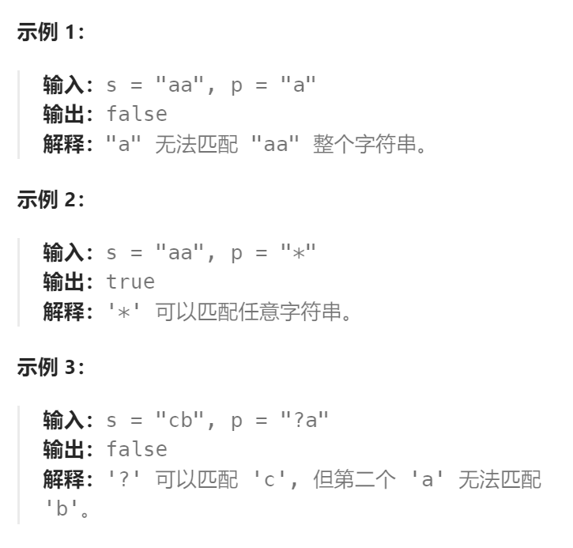

题目：

给你一个输入字符串 (`s`) 和一个字符模式 (`p`) ，请你实现一个支持 `'?'` 和 `'*'` 匹配规则的通配符匹配：

- `'?'` 可以匹配任何单个字符。
- `'*'` 可以匹配任意字符序列（包括空字符序列）。

判定匹配成功的充要条件是：字符模式必须能够 **完全匹配** 输入字符串（而不是部分匹配）。



题解：

此题与`正则表达式`一题基本一样。只不过`*`不再需要依赖额外的字母进行匹配，而是可以单独匹配任意的字符序列，因此只需稍加改动即可：

```go
func isMatch(s string, p string) bool {
    m, n := len(s), len(p)
    // 查看 s[i] 和 p[j] 是否能够相互匹配(s[i] == p[j] 或者 p[j] == '?' ) 
    matches := func(i, j int) bool {
        if i == 0 {
            return false
        }
        if p[j-1] == '?' {
            return true
        }
        return s[i-1] == p[j-1]
    }

    // f[i][j]表示: s的前i个字符 与 p的前j个字符 能否匹配
    f := make([][]bool, m + 1)
    for i := 0; i < len(f); i++ {
        f[i] = make([]bool, n + 1)
    }
    // base case: s和p都是空串，一定能匹配
    f[0][0] = true

    for i := 0; i <= m; i++ {
        for j := 1; j <= n; j++ {
            // 1. 当前p子串的最后一个字符是 '*'
            if p[j-1] == '*' {  // j是当前p子串的长度, j-1 才是子串最后一个字符的下标
                // 方式一：浪费p子串的 *, 不匹配s子串的任何字符
                // 方式二：使用 * 与 s子串进行匹配
                f[i][j] = f[i][j-1]   // 改动的地方，不匹配时只需跳过当前的*即可，不需要额外跳过一个字母
                if i - 1 >= 0 {     // 改动的地方.不再需要把 * 前面的字符与s的最后一个字符进行匹配
                    f[i][j] = f[i][j-1] || f[i-1][j]
                }
            // 2. 当前p子串的最后一个字符不是 '*'
            // 查看s[i-2]和p[j-2]能否匹配
            } else if matches(i, j) {
                f[i][j] = f[i-1][j-1]
            }
        }
    }
    return f[m][n]
}
```

