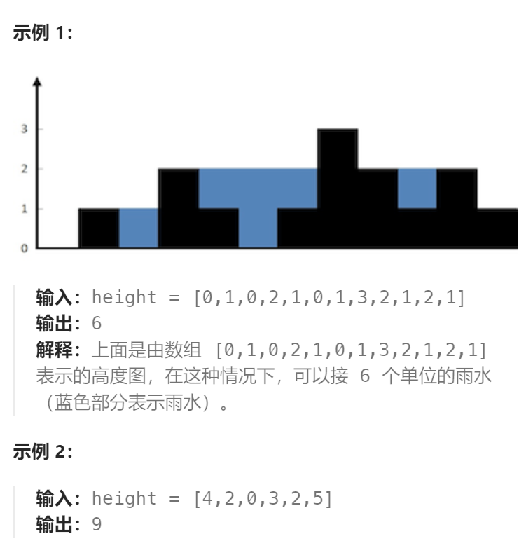

题目：

给定 `n` 个非负整数表示每个宽度为 `1` 的柱子的高度图，计算按此排列的柱子，下雨之后能接多少雨水。



题解：

思路：

1. 我们可以先求**第 i 个位置的蓄水量**：
   计算公式为 `water_i = max{0, min[max(左侧直方图高度),max(右侧直方图高度)] - i位置直方图高度}`
   比如 i=1，左侧高度为3，右侧高度为5，因此蓄水量 = 3-1 = 2
   特殊的，对于 `i=0` 和 `i=len(arr)-1`  这两个位置由于分别在左侧和右侧是0，因此无法存水。

2. 求完每一个位置的蓄水量之和，我们在**将所有 water_i 加起来，得到总的蓄水量 water_sum**
3. 为了方便求解，可以实现准备一个 **左侧直方图最大高度 辅助数组**，存储每一个位置的 `max(左侧直方图高度)`; 然后再准备一个 **右侧直方图最大高度 辅助数组**，存储每一个位置的 `max(右侧直方图高度)`。假设数组 height\ 的长度为 n ，该做法需要对每个下标位置使用 O(n) 的时间向两边扫描并得到最大高度，因此总时间复杂度是 `O(n^2) `。
4. 为了缩短求解辅助数组的复杂度，我们可以用动态规划来求解，使时间复杂度缩减到`O(N)`。求两个辅助数组，因此需要**两次动态规划**。

```go
func trap(height []int) int {
    n := len(height)
    // dp[i][0]: 记录第 i 个柱子左侧柱子的最高高度
    // dp[i][1]: 记录第 i 个柱子右侧柱子的最高高度
    dp := make([][2]int, n)
    // base case: 左边界和右边界柱子都是比较特殊的
    dp[0][0] = 0    // 左边界柱子没有更左侧的柱子
    dp[n-1][1] = 0  // 右边界柱子没有更右侧的柱子
    // 求每根柱子，其左侧的最高柱子高度
    for i := 1; i < n; i++ {
        dp[i][0] = getMax(dp[i-1][0], height[i-1])
    }
    // 求每根柱子，其有侧的最高柱子高度
    for i := n-2; i >= 0; i-- {
        dp[i][1] = getMax(dp[i+1][1], height[i+1])
    }
    sum := 0   // 统计总的雨水量
    // 遍历算出每根柱子上积蓄的雨水量
    for i := 0; i < n; i++ {
        rain := getMax(0, getMin(dp[i][0], dp[i][1]) - height[i])  
        sum += rain
    }
    return sum
}
func getMax(a, b int) int {
    if a > b {
        return a
    } else {
        return b
    }
}
func getMin(a, b int) int {
    if a < b {
        return a
    } else {
        return b
    }
}
```

