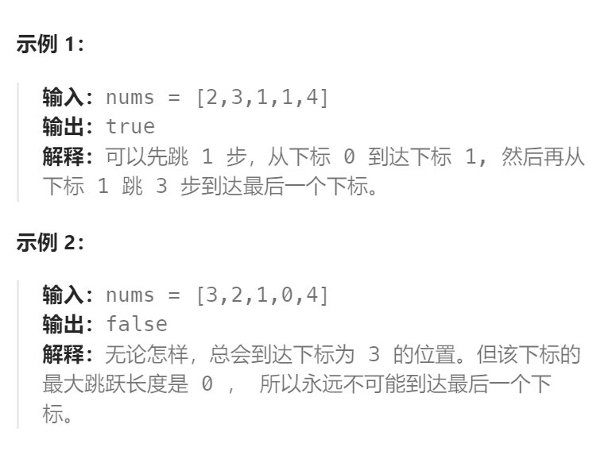

题目：

给你一个非负整数数组 `nums` ，你最初位于数组的 **第一个下标** 。数组中的每个元素代表你在该位置可以跳跃的最大长度。

判断你是否能够到达最后一个下标，如果可以，返回 `true` ；否则，返回 `false` 。



题解：

最优的方法是用贪心算法解决，这里使用的是动态规划法解决：

解题的思路，与`dp`解决字符串问题的思路一致。

```go
func canJump(nums []int) bool {
    n := len(nums)
    // dp[i]表示: 能否到达索引位置 i
    dp := make([]bool, n)
    // base case: 初始位置就是 0，肯定能到达
    dp[0] = true

    for pos := 1; pos <= n-1; pos++ {
        dp[pos] = false
        for lastPos := 0; lastPos < pos; lastPos++ {
            if lastPos + nums[lastPos] < pos {   // 从lastPos无法一步跳到当前pos
                continue   // 尝试其他的lastPos
            } else {   // 从lastPos可以一步跳到当前pos
                dp[pos] = dp[pos] || dp[lastPos]
            }
        }
    }
    return dp[n-1]
}
```

