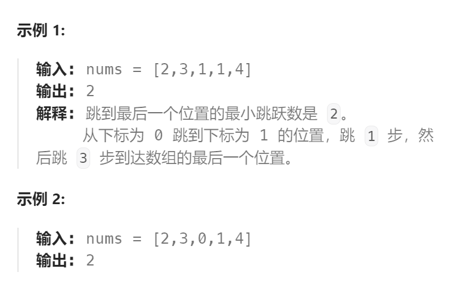

题目：

给定一个长度为 `n` 的 **0 索引**整数数组 `nums`。初始位置为 `nums[0]`。

每个元素 `nums[i]` 表示从索引 `i` 向前跳转的最大长度。换句话说，如果你在 `nums[i]` 处，你可以跳转到任意 `nums[i + j]` 处:

- `0 <= j <= nums[i]` 
- `i + j < n`

返回到达 `nums[n - 1]` 的最小跳跃次数。生成的测试用例可以到达 `nums[n - 1]`。



题解：

```go
func jump(nums []int) int {
    n := len(nums)
    // dp[i]表示: 到达索引位置 i 时需要的最小跳跃次数
    dp := make([]int, n)
    // base case: 初始位置就是 0，不需要跳跃
    dp[0] = 0  
    for pos := 1; pos <= n-1; pos++ {
        dp[pos] = math.MaxInt
        for lastPos := 0; lastPos < pos; lastPos++ {
            if lastPos + nums[lastPos] < pos {   // 从lastPos无法一步跳到当前pos
                continue   // 尝试其他的lastPos
            } else {   // 从lastPos可以一步跳到当前pos
                dp[pos] = getMin(dp[pos], dp[lastPos] + 1)
            }
        }
    }
    return dp[n-1]
}
func getMin(a, b int) int {
    if a < b {
        return a
    } else {
        return b
    }
}
```

