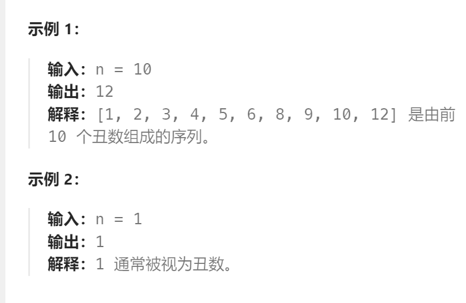

题目：

给你一个整数 `n` ，请你找出并返回第 `n` 个 **丑数** 。

**丑数** 就是只包含质因数 `2`、`3` 和/或 `5` 的正整数。



题解：

```go
func nthUglyNumber(n int) int {
    // dp[i]: dp[i] 中记录着第 i 个丑数
    dp := make([]int, n+1)   // dp[0]不使用
    // base case: 第1个丑数被规定为1
    dp[1] = 1  
    // 如果p是丑数，那么p = 2^x * 3^y * 5^z。那么只要赋予x,y,z不同的值就能得到不同的丑数。
    // x,y,z 分别表示三种路线到达当前p, 所使用的上一个丑数的下标(是第几个丑数)
    x, y, z := 1, 1, 1
    for i := 2; i <= n; i++ {
        p2, p3, p5 := dp[x]*2, dp[y]*3, dp[z]*5
        dp[i] = getMin(p2, getMin(p3, p5))   // 每次都从三种路线中, 选择值最小的一种选择
        // 因为可能出现 p2 == p3 或者 p2 == p5 或者 p3 == p5 这种相等的情况
        // 因此需要保证每一个能到达当前第i个丑数p的路线，对应的指针都应该++，因此是if并列，而不是if else
        if dp[i] == p2 {    
            x++
        } 
        if dp[i] == p3 {
            y++
        } 
        if dp[i] == p5 {
            z++
        }
    }
    return dp[n]
}
func getMin(a, b int) int {
    if a < b {
        return a
    } else {
        return b
    }
}
```

