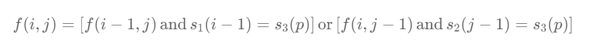

题目：

给定三个字符串 `s1`、`s2`、`s3`，请你帮忙验证 `s3` 是否是由 `s1` 和 `s2` **交错** 组成的。

两个字符串 `s` 和 `t` **交错** 的定义与过程如下，其中每个字符串都会被分割成若干 **非空** 子字符串：

- `s = s1 + s2 + ... + sn`
- `t = t1 + t2 + ... + tm`
- `|n - m| <= 1`
- **交错** 是 `s1 + t1 + s2 + t2 + s3 + t3 + ...` 或者 `t1 + s1 + t2 + s2 + t3 + s3 + ...`

**注意：**`a + b` 意味着字符串 `a` 和 `b` 连接。


题解：

我们定义 `f(i,j)` 表示 `s1的前 i 个元素` 和 `s2 的前 j 个元素` 是否能交错组成 `s3 的前 i+j 个元素`。

1. 如果 ` s1 的第 i 个元素` 和 `s3 的第 i+j 个元素` 相等。那么 `s1 的前 i 个元素` 和 `s2 的前 j 个元素` 是否能交错组成 `s3 的前 i+j 个元素` 取决于 `s1 的前 i−1 个元素` 和 `s2 的前 j 个元素` 是否能交错组成 `s3 的前 i+j−1 个元素`，即**此时 f(i,j) 取决于 f(i−1,j)** ，在此情况下如果 f(i−1,j) 为真，则 f(i,j) 也为真。
2. 如果 `s2 的第 j 个元素` 和 `s3 的第 i+j 个元素` 相等并且 **f(i,j−1) 为真，则 f(i,j) 也为真**。

于是我们可以推导出这样的动态规划转移方程：



其中 p=i+j−1 。边界条件为 f(0,0)=True 。至此，我们很容易可以给出这样一个实现：

```go
func isInterleave(s1 string, s2 string, s3 string) bool {
    n, m, t := len(s1), len(s2), len(s3)
    if (n + m) != t {   // 长度必须满足 len(s1) + len(s2) == len(s3)
        return false
    }
    // f[i][j]表示: 用 s1的前i个字符 和 s2的前j个字符 能否组成s3的前i+j个字符
    f := make([][]bool, n + 1)
    for i := 0; i <= n; i++ {
        f[i] = make([]bool, m + 1)
    }
    // base case: s1空串 + s2空串 组成 s3空串，是可以的
    f[0][0] = true
    // base case: s1空串，s3必须全部由s2组成
    for j := 1; j <= m; j++ {
        f[0][j] = f[0][j-1] && s2[j-1] == s3[j-1]
    }
    // base case: s2空串, s3必须全部由s1组成
    for i := 1; i <= n; i++ {
        f[i][0] = f[i-1][0] && s1[i-1] == s3[i-1]
    }
	// i和j 分别表示 s1子串的长度 和 s2子串的长度
    for i := 1; i <= n; i++ {
        for j := 1; j <= m; j++ {
            p := i + j - 1   // p 表示 s3 子串的下一个待匹配的字符的下标
            // 分为两种情况: 
            // 1. 用 s1 子串的最后一个字符去匹配 s3 子串的最后一个字符, 即判断: s3[p] == s1[i-1] 
            // 2. 用 s2 子串的最后一个字符去匹配 s3 子串的最后一个字符, 即判断: s3[p] == s2[j-1]
            f[i][j] = (f[i-1][j] && s1[i-1] == s3[p]) || (f[i][j-1] && s2[j-1] == s3[p])  
        }
    }
    return f[n][m]
}
```


