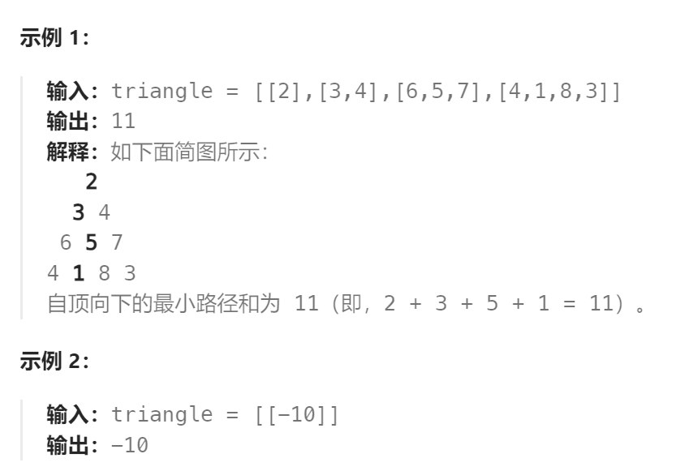

题目：

给定一个三角形 `triangle` ，找出自顶向下的最小路径和。

每一步只能移动到下一行中相邻的结点上。**相邻的结点** 在这里指的是 **下标** 与 **上一层结点下标** 相同或者等于 **上一层结点下标 + 1** 的两个结点。也就是说，如果正位于当前行的下标 `i` ，那么下一步可以移动到下一行的下标 `i` 或 `i + 1` 。



题解：

思路：

走到三角形任意一个点 ( i , j ) 有两种方法：

- 从`(i-1,j) `往正下方走
- 从`(i-1,j-1)` 往右下方走

因此，任意一个点`(i,j)` 需要从 正上方 和左上方 两条路径中找出最短的一条，得到以下状态转移方程：

- `dp[i][j]` = min( `dp[i-1,j]`, `dp[i-1,j-1]` )  + triangle[i] [j]
- 因为三角形最左侧列没有左上方只有正上方，因此`dp[i][j] = dp[i-1,j] + triangle[i][j]`
- 因为三角形最右侧列没有正上方只有左上方，因此`dp[i][j] = dp[i-1,j-1] + triangle[i][j]`

上述的转移方程决定了：`dp[i][j]` 必须按照 ：从上往下，从左向右的顺序求解

```go
func minimumTotal(triangle [][]int) int {
    n := len(triangle)
    // dp[i][j] 表示三角形中(i,j)位置到达最后一行时的最短路径
    dp := make([][]int, len(triangle)) 
    for i:=0; i<len(triangle); i++ {
        dp[i] = make([]int, len(triangle[i]))
    }
    dp[0][0] = triangle[0][0]  // base case
    
    // 三角形最左侧一列，每个dp[i][0]都 == dp[i-1][0] + triangle[i][0]，依赖于正上方
    for row := 1; row < n; row++ {
        dp[row][0] = triangle[row][0] + dp[row-1][0]
    }
    
    // 三角形最右侧一列，每个dp[i][mostRight] == dp[i-1][mostRight+1] + triangle[i][mostRight]，依赖于左上方
    for row := 1; row < n; row++ {
        mostRight := len(triangle[row]) - 1  // 当前行的最右侧列号
        dp[row][mostRight] = triangle[row][mostRight] + dp[row-1][mostRight-1]
    }
    
    // 每个 dp[i][j] == triangle[i][j] + min(dp[i-1][j], dp[i-1][j-1]), 依赖于正上方和左上方
    // 必须按照: 从上向下，从左向右的顺序求解
    for row := 2; row < n; row++ {
        mostRight := len(triangle[row]) - 1  // 当前行的最右侧列号
        for col := 1; col < mostRight; col++ {
            dp[row][col] = getMin(dp[row-1][col], dp[row-1][col-1]) + triangle[row][col]
        }
    }
    // 从最后一行获取最小路径和
    shortest := math.MaxInt
    for col := 0; col < len(triangle[n-1]); col++ {
        if dp[n-1][col] < shortest {
            shortest = dp[n-1][col]
        }
    }
    return shortest
}

func getMin(a,b int) int {
    if a < b {
        return a
    } else {
        return b
    }
}
```

