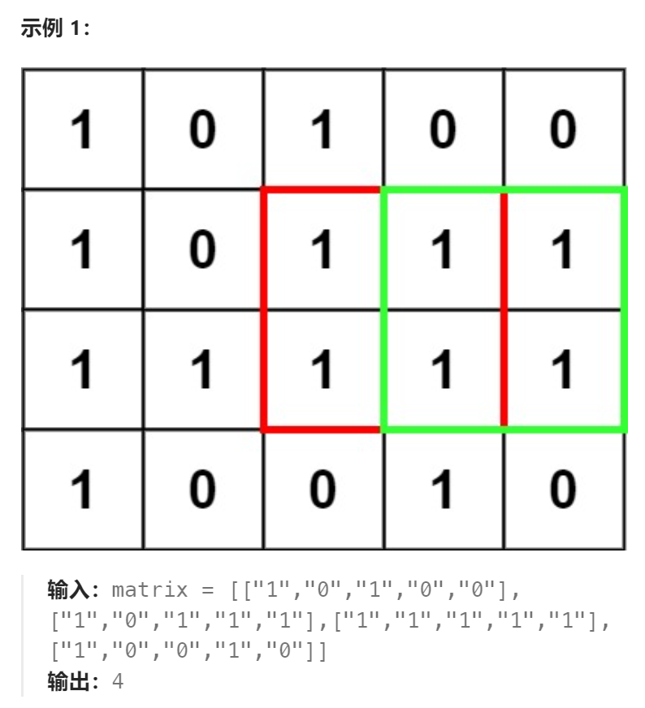

题目：

在一个由 `'0'` 和 `'1'` 组成的二维矩阵内，找到只包含 `'1'` 的最大正方形，并返回其**面积**。




题解：

```go
func maximalSquare(matrix [][]byte) int {
    rowCount, colCount := len(matrix), len(matrix[0])
    // dp[i][j] 表示以(i,j)为左上角的最大正方形的边长
    dp := make([][]int, rowCount)
    for i:=0; i < rowCount; i++ {
        dp[i] = make([]int, colCount)
    }
    maxEdge := math.MinInt  // 记录最大正方形的边长
    // base case: 最后一行，如果 matrix[i][j] == '1'，那么dp[i][j] = 1, 否则为0
    for col:=0; col < colCount; col++ {
        if matrix[rowCount-1][col] == '1' {
            dp[rowCount-1][col] = 1
            maxEdge = getMax(maxEdge, 1)
        } else {
            dp[rowCount-1][col] = 0
        }
    }
    // base case: 最后一列，如果 matrix[i][j] == '1'，那么dp[i][j] = 1, 否则为0
    for row:=0; row < rowCount; row++ {
        if matrix[row][colCount-1] == '1' {
            dp[row][colCount-1] = 1
            maxEdge = getMax(maxEdge, 1)
        } else {
            dp[row][colCount-1] = 0
        }
    }
    // dp[i][j] 的大小依赖于 dp[i+1][j+1], dp[i+1][j], dp[i][j+1] , 分别是自己的右下角，正右侧，正下方
    // 因此求解顺序是: 从下往上，从右向左
    for row := rowCount-2; row >= 0; row-- {
        for col := colCount-2; col >= 0; col-- {
            if matrix[row][col] == '0' {  // (i,j)位置本身是0，那么组不成正方形
                dp[row][col] = 0
                continue
            }
            if dp[row+1][col+1] == 0 {   // 右下角不是正方形
                if matrix[row][col] == '1' {
                    dp[row][col] = 1
                    maxEdge = getMax(maxEdge, dp[row][col])
                } else {
                    dp[row][col] = 0
                }
            } else {  // 右下角是正方形
                // dp[row][col]的大小取决于:
                // 1. 右侧1的个数(右侧正方形的边长)
                // 2. 下方1的个数(下方正方形的边长)
                // 3. 右下方1的正方形边长
                dp[row][col] = 1 + getMin(dp[row+1][col+1], getMin(dp[row+1][col], dp[row][col+1]))
                maxEdge = getMax(maxEdge, dp[row][col])
            }
        }
    }
    return maxEdge*maxEdge
}
func getMax(a,b int) int {
    if a > b {
        return a
    } else {
        return b
    }
}
func getMin(a,b int) int {
    if a < b {
        return a
    } else {
        return b
    }
}
```

