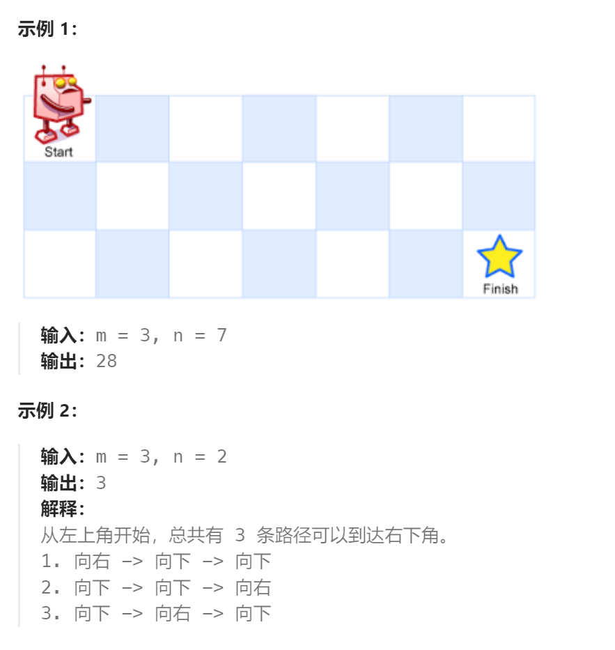

题目：

一个机器人位于一个 `m x n` 网格的左上角 （起始点在下图中标记为 “Start” ）。

机器人每次只能**向下**或者**向右**移动一步。机器人试图达到网格的右下角（在下图中标记为 “Finish” ）。

问总共有多少条不同的路径？



题解：

```go
func uniquePaths(m int, n int) int {
    dp := make([][]int, m)   // 0~m-1 行
    for i:=0; i<=m-1; i++ {
        dp[i] = make([]int, n)  // 0~n-1 列
    }
    // 最下层，只能通过向右走到达终点
    for col:=0; col<n; col++ {
        dp[m-1][col] = 1
    }
    // 最右列，只能通过向下走到终点
    for row:=0; row<m; row++ {
        dp[row][n-1] = 1
    }
    // 从下向上，从右向左 进行求解
    for row:=m-2; row>=0; row-- {
        for col:=n-2; col>=0; col-- {
            // dp[row][col]的路径数 = 下方格子到终点的路径数 + 右侧格子到终点的路径数
            dp[row][col] = dp[row][col+1] + dp[row+1][col]
        }
    }
    return dp[0][0]
}
```

