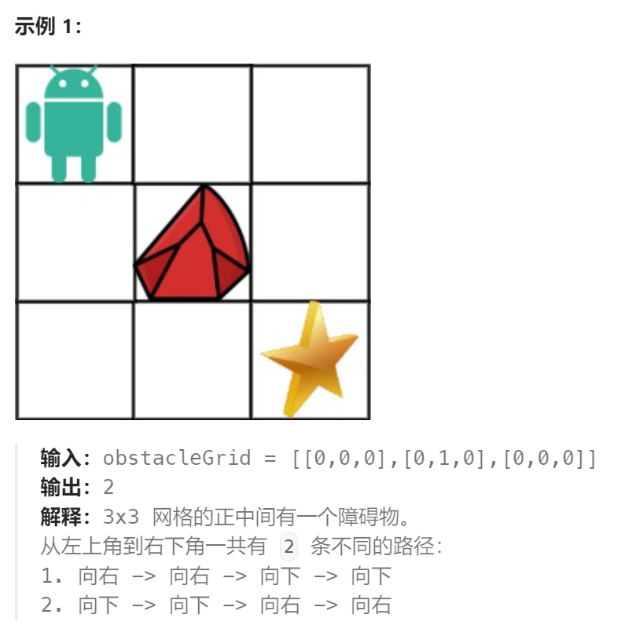

题目：

一个机器人位于一个 `m x n` 网格的左上角 （起始点在下图中标记为 “Start” ）。

机器人每次只能向下或者向右移动一步。机器人试图达到网格的右下角（在下图中标记为 “Finish”）。

现在考虑网格中有障碍物。那么从左上角到右下角将会有多少条不同的路径？

网格中的障碍物和空位置分别用 `1` 和 `0` 来表示。




题解：

```go
func uniquePathsWithObstacles(obstacleGrid [][]int) int {
    rowCount := len(obstacleGrid)
    colCount := len(obstacleGrid[0])
    dp := make([][]int, rowCount)
    for i:=0; i<rowCount; i++ {
        dp[i] = make([]int, colCount)
    }

    if obstacleGrid[rowCount-1][colCount-1] == 1 {
        dp[rowCount-1][colCount-1] = 0
    } else {
        dp[rowCount-1][colCount-1] = 1
    }
    // 最下行只能通过右移到达终点
    for col := colCount-2; col >= 0; col-- {
        if obstacleGrid[rowCount-1][col] == 1 {  // 当前位置是障碍物，那么将无法到达终点
            dp[rowCount-1][col] = 0
        } else {
            dp[rowCount-1][col] = dp[rowCount-1][col+1]  // 仅依赖于右侧
        }
    }
    // 最右列只能通过下移到达终点
    for row := rowCount-2; row >= 0; row-- {
        if obstacleGrid[row][colCount-1] == 1 {  // 当前位置是障碍物，那么将无法到达终点
            dp[row][colCount-1] = 0
        } else {
            dp[row][colCount-1] = dp[row+1][colCount-1]  // 仅依赖于下侧
        }       
    }
    // 从下向上，从右向左
    for row := rowCount-2; row >= 0; row-- {
        for col := colCount-2; col >= 0; col-- {
            if obstacleGrid[row][col] == 1 {  // 当前位置是障碍物，那么将无法到达终点
                dp[row][col] = 0
            } else {
                dp[row][col] = dp[row+1][col] + dp[row][col+1]  // 依赖于右侧和下侧
            }    
        }
    }
    return dp[0][0]
}
```

