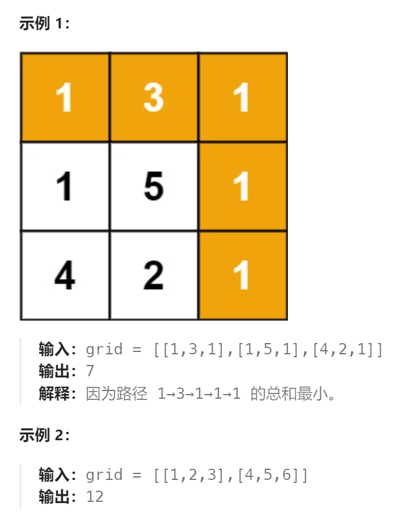

题目：

给定一个包含非负整数的 `m*n` 网格 `grid` ，请找出一条从左上角到右下角的路径，使得路径上的数字总和为最小。

**说明：**每次只能**向下**或者**向右**移动一步。



题解：

```go
func minPathSum(grid [][]int) int {
    rowCount := len(grid)
    colCount := len(grid[0])

    // dp[i][j]： 表示从(i,j)到达终点的最小路径和
    dp := make([][]int, rowCount)  
    for i:=0; i<rowCount; i++ {
        dp[i] = make([]int, colCount)
    }
    // 终点到终点的路径和 == 终点格子的值
    dp[rowCount-1][colCount-1] = grid[rowCount-1][colCount-1]

    // 最底行: 只能通过向右移动到终点
    for col := colCount-2; col >= 0; col-- {  // 从右向左求路径和
        dp[rowCount-1][col] = dp[rowCount-1][col+1] + grid[rowCount-1][col]
    }
    // 最右列: 只能通过向下移动到终点
    for row:= rowCount-2; row >=0; row-- {  // 从下往上求路径和
        dp[row][colCount-1] = dp[row+1][colCount-1] + grid[row][colCount-1]
    }

    // 从下往上，从右向左求 dp[i][j] 到终点的最短路径和
    for row := rowCount-2; row>=0; row-- {
        for col := colCount - 2; col>=0; col-- {
            dp[row][col] = getMin(dp[row+1][col], dp[row][col+1]) + grid[row][col]
        }
    } 
    return dp[0][0]
}
func getMin(a,b int) int {
    if a < b {
        return a
    } else {
        return b
    }
}
```

