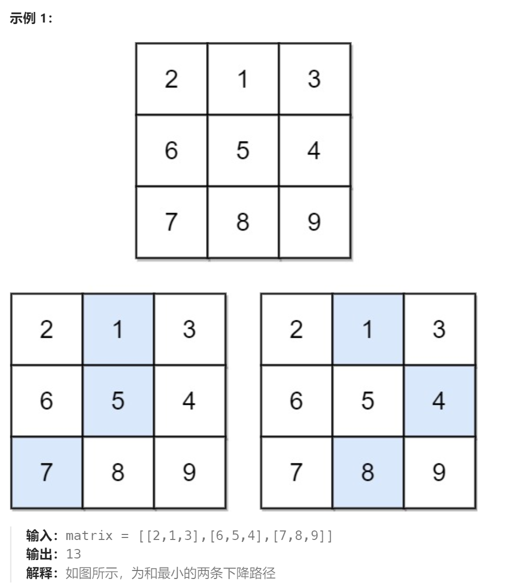

题目：

给你一个 `n x n` 的 **方形** 整数数组 `matrix` ，请你找出并返回通过 `matrix` 的**下降路径** 的 **最小和** 。

**下降路径** 可以从第一行中的任何元素开始，并从每一行中选择一个元素。在下一行选择的元素和当前行所选元素最多相隔一列（即位于正下方或者沿对角线向左或者向右的第一个元素）。具体来说，位置 `(row, col)` 的下一个元素应当是 `(row + 1, col - 1)`、`(row + 1, col)` 或者 `(row + 1, col + 1)` 。




题解：

```go
func minFallingPathSum(matrix [][]int) int {
    rowCount := len(matrix)
    colCount := len(matrix[0])
    // dp[i][j]表示以(i,j)为终点的下降路径最小和
    // dp[i][j] = matrix[i][j] + min( dp[i-1][j-1], dp[i-1][j], dp[i-1][j+1] )
    // dp[i][j] 依赖于自己的: 左上方 正上方 右上方 三个元素
    dp := make([][]int, rowCount)
    for i:=0; i<rowCount; i++ {
        dp[i] = make([]int, colCount)
    }
    // base case: 第一行的dp[0][j] = matrix[0][j]
    for col:=0; col < colCount; col++ {
        dp[0][col] = matrix[0][col]
    }
    // 最左侧一列只依赖于正上方和右上方,最右侧一列只依赖于正上方和左上方
    for row:=1; row < rowCount; row++ {
        dp[row][0] = matrix[row][0] + getMin(dp[row-1][0], dp[row-1][1])
        dp[row][colCount-1] = matrix[row][colCount-1] + getMin(dp[row-1][colCount-1], dp[row-1][colCount-2])

        for col:=1; col < colCount-1; col++ {
            before := getMin(dp[row-1][col], getMin(dp[row-1][col-1], dp[row-1][col+1]))
            dp[row][col] = matrix[row][col] + before
        }
    }
    minVal := math.MaxInt
    for col:=0; col < colCount; col++ {
        if dp[rowCount-1][col] < minVal {
            minVal = dp[rowCount-1][col]
        }
    }
    return minVal
}
func getMin(a,b int) int {
    if a < b {
        return a
    } else {
        return b
    }
}
```

