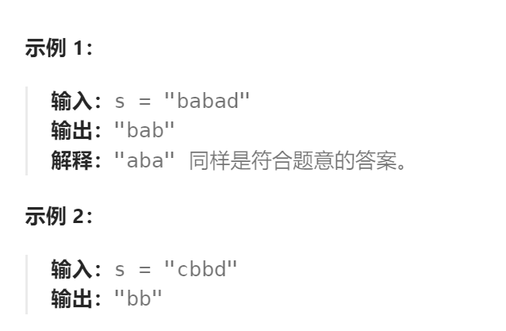

题目：

给你一个字符串 `s`，找到 `s` 中最长的回文子串。

如果字符串的反序与原始字符串相同，则该字符串称为回文字符串。



题解：

- `s[i:j]`是否是回文子串取决于：
  - `s[i] == s[j]` 是否成立
  - `s[i+1:j-1]`是否是回文子串
- 如果 `i == j`，则`s[i:i]` 必然是回文子串，且长度为1
- 如果`i == j-1` ，且`s[i] == s[j]` ，则`s[i:j]` 必然是长度为2的回文子串

```go
func longestPalindrome(s string) string {
    n := len(s)
    // dp[start][end] 表示 s[start]~s[end]的子串是否是回文子串
    // start 和 end 的取值范围都是 0~n-1
    dp := make([][]bool, n)
    for i:=0; i<n; i++ {
        dp[i] = make([]bool, n)
    }
    maxLen := 1   // 记录最长回文子串的长度
    maxStart := n-1  // 记录最长回文子串的起点
    // base case: 以每一个单独字符为子串的回文长度是1。后续不再需要求解长度为1的子串是否是回文子串
    for i:=0; i<n; i++ {
        dp[i][i] = true   // 不会改变 maxLen
    }
    // base case: 根据两个相邻字符是否相等判断所有长度为2的子串是否是回文子串。后续不再需要求解长度为2的子串是否是回文子串
    for i:=0; i<n-1; i++ {
        if s[i] == s[i+1] {
            dp[i][i+1] = true
        } else {
            dp[i][i+1] = false
        } 
        if dp[i][i+1] && maxLen == 1{   // 更新最大长度为2
            maxLen = 2
            maxStart = i
        }
    }    
    for length:= 3; length <= n; length++ {  // 枚举子串的长度(最小是3个字符,最大等于原串长度)
        for start := 0; start <= n-1; start++ { // 枚举子串的起点
            end := start + length - 1 // 确定子串的终点
            if end > n - 1 {   // 终点越界
                break
            }
            if s[start] != s[end] {   // 首尾字符不相等，必然不是回文子串
                dp[start][end] = false
            } else {   
                dp[start][end] = dp[start+1][end-1]
            }
            // 当前 s[start]~s[end] 子串是回文子串, 且长度比之前的回文子串都要长，则保留
            if dp[start][end] && length > maxLen {
                maxLen = length
                maxStart = start
            }
        }
    }
    res := []byte{}
    for i:=maxStart; i < maxStart + maxLen; i++ {
        res = append(res, s[i])
    }
    return string(res)
}
```

