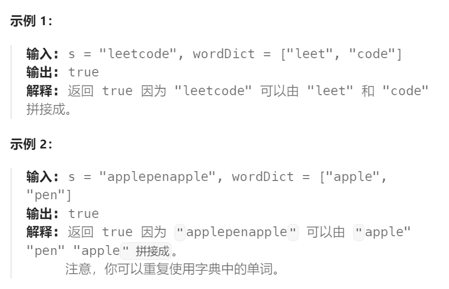

题目：

给你一个字符串 `s` 和一个字符串列表 `wordDict` 作为字典。请你判断是否可以利用字典中出现的单词拼接出 `s` 。

**注意：**不要求字典中出现的单词全部都使用，并且字典中的单词可以重复使用。



题解：

- `dp[i]` 用来表示子串 `s[0:i]` 是否是由字典内的单词组成的
- 假设 `0 <= j <= i < n` ，假设我们已经完成对 `dp[j]` 的判断：
  - 如果`dp[j] == false` 对所有的`j`都成立，那么意味着`dp[i] == false`
  - 一旦存在`dp[j] == true`，且`s[j+1:i]`也是存在于字典内的单词，那么一定有`dp[i] == true`；但如果 `s[j+1:i]`是不存在于字典内的单词，那么一定有`dp[i] == false`
- `dp[i] `依赖于比起更小的 `dp[j]`

```go
func wordBreak(s string, wordDict []string) bool {
    hashMap := make(map[string]bool)
    for i:=0; i<len(wordDict); i++ {
        hashMap[wordDict[i]] = true
    }
    // dp[i] 表示 s[i] 之前的(不包括s[i])子串能否由字典中的单词组成
    dp := make([]bool, len(s)+1)
    // base case: 表示一个空串，不需要字典提供就能组成
    dp[0] = true

    for end := 1; end <= len(s); end++ {   // s[0]~s[end-1] 为本次判断的子串
        for lastEnd := 0; lastEnd < end; lastEnd++ {   
            if dp[lastEnd] && hashMap[s[lastEnd:end]] {  // s[0]~s[end] 是由一个已判断的子串+新的单词组成
                dp[end] = true
                break
            }
        }
    }
    return dp[len(s)]   // 判断s[0]~s[len(s)-1] 整个字符串是否都可以由字典中单词组成
}
```

