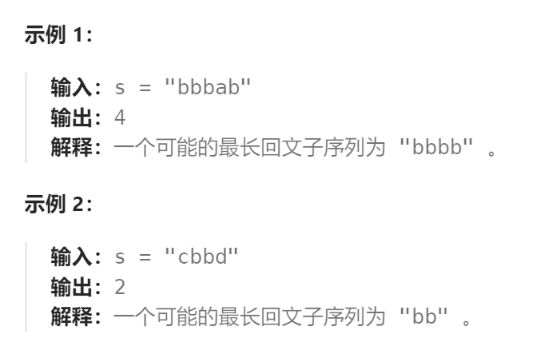
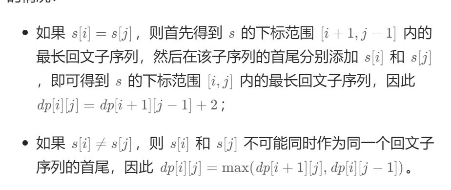

题目：

给你一个字符串 `s` ，找出其中最长的回文子序列，并返回该序列的长度。

子序列定义为：不改变剩余字符顺序的情况下，删除某些字符或者不删除任何字符形成的一个序列。



题解：

此题在`最长回文子串`题目的基础上，需要额外考虑`s[i] != s[j]` 时的情况：



左右不相等，意味着要么删除左侧字符`s[i]`，要么删除右侧字符`s[j]`。删除的依据是：要保证删除后，回文子序列的长度最大。因此是：

```
dp[i][j] = getMax(dp[i][j-1], dp[i+1][j])
```

```go
func longestPalindromeSubseq(s string) int {
    n := len(s)
    // dp[i][j] 表示 s[i]~s[j] 子串内部回文子序列的最大长度
    // i：起点的下标，0~n-1
    // j: 终点的下标，0~n-1
    dp := make([][]int, n)
    for i:=0; i < n; i++ {
        dp[i] = make([]int, n)
    }
    // base case: 任何单一字符组成的子串, 最长回文子序列长度为1
    for i:=0; i < n; i++ {
        dp[i][i] = 1
    }
    // base case: 任何长度为2的子串，如果两个字符相等则回文长度为2，否则为1
    for i:=0; i < n-1; i++ {
        if s[i] == s[i+1] {
            dp[i][i+1] = 2
        } else {
            dp[i][i+1] = 1
        }
    }
    for length := 3; length <= n; length++ {
        for start := 0; start < n; start++ {
            end := start + length - 1
            if end >= n {   // end 越界
                break
            }
            if s[start] == s[end] {
                dp[start][end] = dp[start+1][end-1] + 2
            } else {
                dp[start][end] = getMax(dp[start][end-1], dp[start+1][end])
            }
        }
    }
    return dp[0][n-1]
}
func getMax(a,b int) int {
    if a > b {
        return a
    } else {
        return b
    }
}
```

