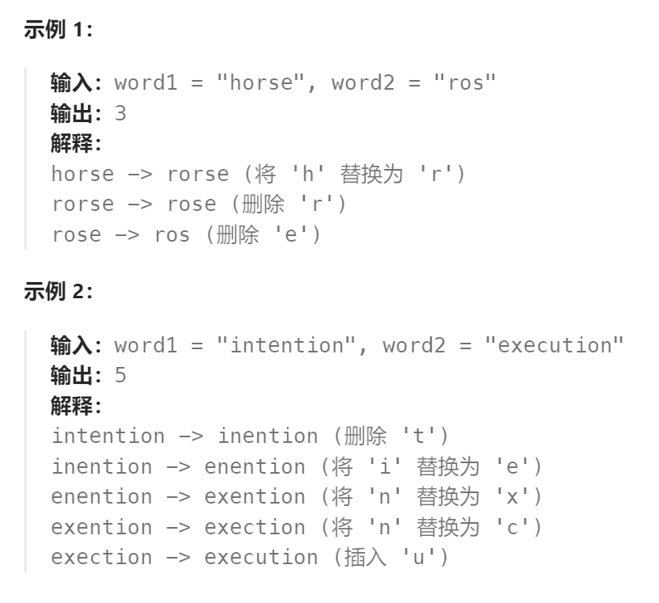

题目：

给你两个单词 `word1` 和 `word2`， *请返回将 `word1` 转换成 `word2` 所使用的最少操作数* 。

你可以对一个单词进行如下三种操作：

- 插入一个字符
- 删除一个字符
- 替换一个字符



题解：

```go
func minDistance(word1 string, word2 string) int {
    if len(word1) == 0 {   // 全部是插入操作
        return len(word2)
    }
    if len(word2) == 0 {  // 全部是删除操作
        return len(word1)
    }

    len1 := len(word1) + 1  // 多出一个空字符的位置
    len2 := len(word2) + 1  // 多出一个空字符的位置

    // dp[i][j] 表示将 word1[0:i] 编辑为 word2[0:j] 的最少操作数 
    dp := make([][]int, len1)
    for i:=0; i < len1; i++ {
        dp[i] = make([]int, len2)
    } 
    // base case: 第一行，就是将 word1[0:0] 编辑成 word2[0:j]，需要进行 j 次插入操作
    for col:=0; col < len2; col++ {
        dp[0][col] = col
    }
    // base case: 第一列，就是将 word1[0:i] 编辑成 word2[0:0], 需要进行 i 次删除操作
    for row:=0; row < len1; row++ {
        dp[row][0] = row
    }
    // 从上向下，从左向右求解. 因为每个 dp[i][j] 依赖于: 左侧的dp[i][j-1]  上方的dp[i-1][j]  左上方的dp[i-1][j-1]
    for row := 1; row < len1; row++ {
        for col := 1; col < len2; col++ {
            // 方法一: 先将 word1[0:row] 编辑成 word2[0:col-1]，再插入一个 word2[col]
            way1 := dp[row][col-1] + 1  // 依赖于正左侧
            // 方法二：先将 word1[0:row-1] 编辑成 word2[0:col], 在删除一个 word1[row]
            way2 := dp[row-1][col] + 1  // 依赖于正上方
            // 方法三: 先将 word1[0:row-1] 编辑成 word2[0:col-1], 再将 word1[row] 变成 word2[col]
            way3 := dp[row-1][col-1]    // 依赖于左上方
            // 仅当两个字符不相等的时候, 才需要进行替换操作
            // 需要注意: 因为多出了一个空字符 dp[0][0]，导致查询word1和word2时，真实的下标比当前使用row和col要小1
            if word1[row-1] != word2[col-1] {  
                way3 += 1
            }
            dp[row][col] = getMin(way1, getMin(way2, way3))
        }
    }
    return dp[len1-1][len2-1]
}

func getMin(a,b int) int {
    if a < b {
        return a
    } else {
        return b
    }
}
```

