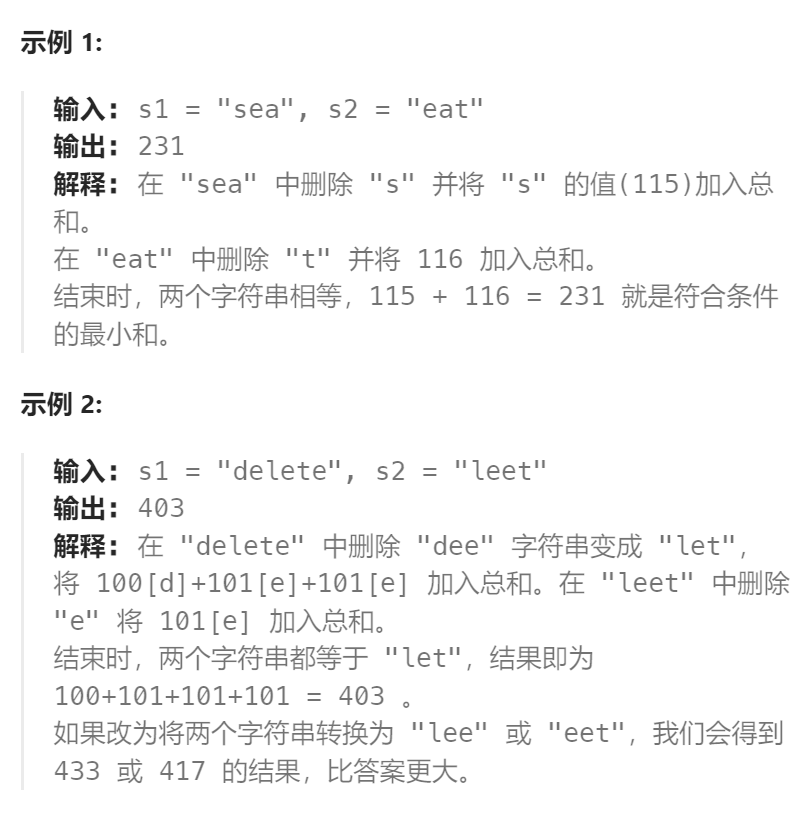

题目：

给定两个字符串`s1` 和 `s2`，返回 *使两个字符串相等所需删除字符的 **ASCII** 值的最小和* 。



题解：

```go
func minimumDeleteSum(s1 string, s2 string) int {
    if len(s1) == 0 {   // 删除掉s2中所有字符
        total := 0
        for i:=0; i < len(s2); i++ {
            total += int(s2[i])
        }
        return total
    }
    if len(s2) == 0 {   // 删除掉s1中所有字符
        total := 0
        for i:=0; i < len(s1); i++ {
            total += int(s1[i])
        }
        return total
    }   
    len1 := len(s1) + 1   // 多出一个空字符串
    len2 := len(s2) + 1   // 多出一个空字符串  
    // dp[i][j] 表示让 s1[0:i] 与 s2[0:j] 相等需要删除的字符的 ASCII 值的最小和
    dp := make([][]int, len1)
    for i:=0; i < len1; i++ {
        dp[i] = make([]int, len2)
    }
    dp[0][0] = 0  // s1空字符串变成s2空字符串, 不需要删除任何字符，代价为0

    // base case: 第一行，让 s1[0:0]（空字符串）与s2[0:j] 相等需要删除的字符的 ASCII 值的最小和
    for col := 1; col < len2; col++ {
        dp[0][col] = dp[0][col-1] + int(s2[col-1])   // 依赖于正左侧
    }
    // base case: 第一列, 让 s1[0:i] 与 s2[0:0]（空字符串）相等需要删除的字符的 ASCII 值的最小和
    for row := 1; row < len1; row++ {
        dp[row][0] = dp[row-1][0] + int(s1[row-1])   // 依赖于正上方
    }
    // 每一个 dp[i][j] 依赖于 正左侧 dp[i][j-1] 和 正上方 dp[i-1][j] 以及 左上角 dp[i-1][j-1]
    // 因此求解方向: 从上到下, 从左向右
    for i := 1; i < len1; i++ {
        for j := 1; j < len2; j++ {
            way1 := dp[i][j-1] + int(s2[j-1])
            way2 := dp[i-1][j] + int(s1[i-1])
            way3 := dp[i-1][j-1]
            if s1[i-1] != s2[j-1] {
                way3 += int(s1[i-1])
                way3 += int(s2[j-1])
            }
            dp[i][j] = getMin(way1, getMin(way2, way3))
        }
    }
    return dp[len1-1][len2-1]
}

func getMin(a,b int) int {
    if a < b {
        return a
    } else {
        return b
    }
}
```

