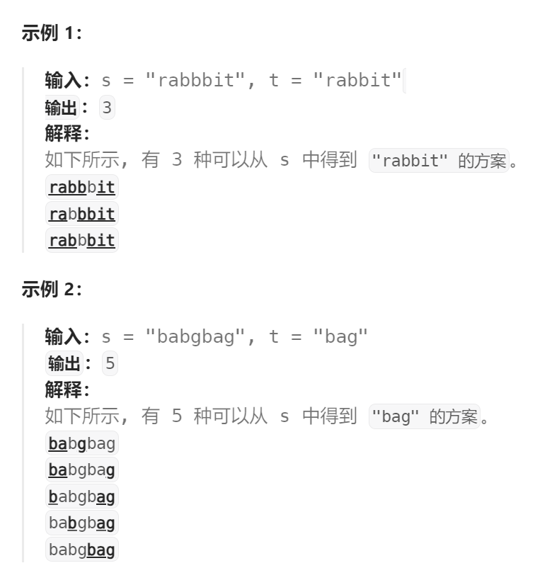

题目：

给你两个字符串 `s` 和 `t` ，统计并返回在 `s` 的 **子序列** 中 `t` 出现的个数，结果需要对 10^9 + 7 取模。




题解：

```go
func numDistinct(s string, t string) int {
    len1 := len(s)  
    len2 := len(t)
    // s 比 t 还要短，那么 t 不可能是 s 的子序列
    if len1 < len2 {
        return 0
    }
    // dp[i][j]表示: s[i:] 子串的子序列中 t[j:] 出现的次数
    dp := make([][]int, len1 + 1)   // +1 是为了提供一个s的空串，横坐标 i == len1 时，表示s是空串
    for i:=0; i < len1 + 1; i++ {
        dp[i] = make([]int, len2 + 1) // +1 是为了提供一个t的空串，纵坐标 j == len2 时，表示t是空串
    }
    dp[len1][len2] = 1  // s的空串的子序列中有一个t的空串
    // base case: 最后一行，s的空串的子序列中t[j:]出现的次数为0
    for j := 0; j <= len2 - 1; j++ {
        dp[len1][j] = 0
    }
    // base case: 最后一列，t的空串是任意s[i:]的子序列(任何子串都有且只有一个空串子序列)
    for i:=0; i <= len1 - 1; i++ {
        dp[i][len2] = 1
    }
    // 如果 s[i] == t[j], t[j:]可以选择在 s[i:] 中进行匹配，或者在 s[i+1:] 中进行匹配 
    // 即 --> dp[i][j] = dp[i+1][j+1]( s[i]和t[j] 已经完成匹配) + dp[i+1][j] (依赖于右下角和正下方)

    // 如果 s[i] != t[j], t[j:]只能选择在 s[i+1:] 中进行匹配
    // 即 --> dp[i][j] = dp[i+1][j]  (依赖于正下方)

    // 因为 dp[i][j] 依赖于 右下方 和 正下方，因此求解顺序需要：自右向左, 自下而上
    for i := len1-1; i >= 0; i-- {
        for j := len2-1; j >= 0; j-- {
            if s[i] == t[j] {
                dp[i][j] = dp[i+1][j+1] + dp[i+1][j]
            } else {
                dp[i][j] = dp[i+1][j]
            }
        }
    }
    return dp[0][0]
}
```

