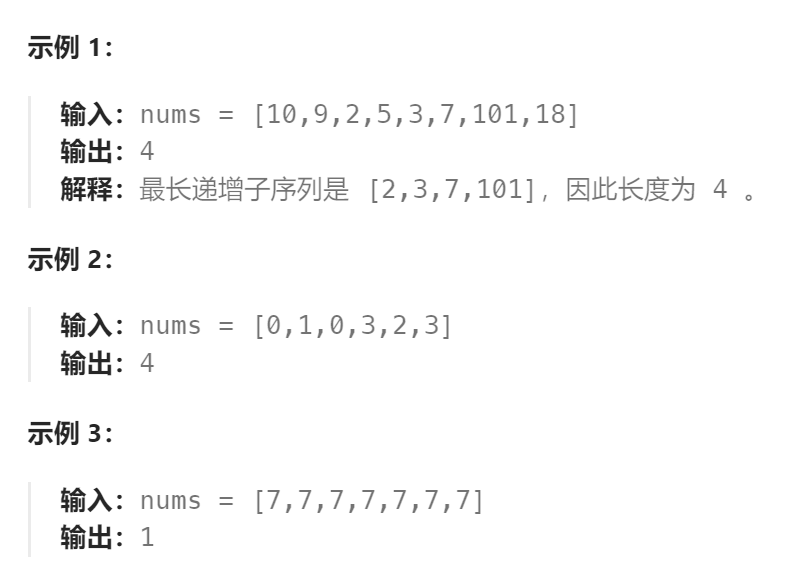

题目：

给你一个整数数组 `nums` ，找到其中最长严格递增子序列的长度。

**子序列** 是由数组派生而来的序列，删除（或不删除）数组中的元素而不改变其余元素的顺序。例如，`[3,6,2,7]` 是数组 `[0,3,1,6,2,2,7]` 的子序列。



题解：

采用递增子序列不断变长的求解策略：

- `dp[i]` 表示 `nums[0]~nums[i]`（`nums[i]`包含在内） 子数组中（ `nums[i]` 作为结尾），最长递增子序列的长度
- 每次遍历到 `nums[i]` ，我们都已经拥有分别以 `nums[0]~nums[i-1]` **作为结尾**的递增子序列的长度。我们从中取出：`结尾数字 < nums[i]` 的最长的递增子序列进行扩充。

```go
func lengthOfLIS(nums []int) int {
    n := len(nums)
    if n == 1 {
        return 1
    }
    // dp[i] 表示 nums[0]~nums[i]（nums[i]包含在内） 子数组中，最长递增子序列的长度
    dp := make([]int, n)
    dp[0] = 1  
    
    maxLen := 1   // 记录最长递增子序列的长度
    for end:=1; end<len(nums); end++ {
        dp[end] = 1   // 初始化为1，单独一个数字构成的递增子序列, 长度就是1
        for lastEnd := 0; lastEnd < end; lastEnd++ {   // 枚举当前位之前的所有递增子序列
            // 当前位的数字 > 之前递增子序列的最后一个数字，就可以扩充递增子序列长度
            if nums[lastEnd] < nums[end] {  
                dp[end] = getMax(dp[end], dp[lastEnd]+1 )  // 选择最长的一个递增子序列进行扩充
            }
        }
        maxLen = getMax(maxLen, dp[end])
    }
    return maxLen
}
func getMax(a, b int) int {
    if a > b {
        return a
    } else {
        return b
    }
}
```

