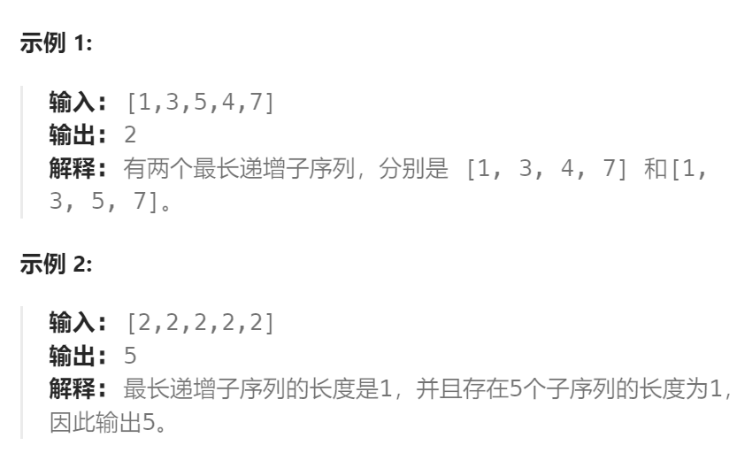

题目：

给定一个未排序的整数数组 `nums` ， *返回最长递增子序列的个数* 。

**注意** 这个数列必须是 **严格** 递增的。



题解：

```go
func findNumberOfLIS(nums []int) int {
    n := len(nums)
    if n == 1 {
        return 1
    }
    // dp[i] 表示: 以 nums[i] 作为结尾数字的子数组中最长递增子序列的长度
    dp := make([]int, n)
    dp[0] = 1
    // cnt[i] 表示: 以 nums[i] 作为结尾数字的子数组中不同最长递增子序列的数量
    cnt := make([]int, n)
    cnt[0] = 1

    maxLen := 1   // 最长递增子序列的长度
    maxCount := 1   // 最长递增子序列的个数

    for end := 1; end < n; end++ {
        dp[end] = 1
        cnt[end] = 1
        for lastEnd := 0; lastEnd < end; lastEnd++ {
            if nums[lastEnd] < nums[end] {
               if dp[lastEnd] + 1 > dp[end] {  // 有更长的子序列
                   dp[end] = dp[lastEnd] + 1
                   // cnt[end] 重新开始计数,所有以不同路径到达lastEnd的递增子序列都加入
                   // 因为以不同路径到达lastEnd, 必然也是以不同路径到达end
                   cnt[end] = cnt[lastEnd]   
               } else if dp[lastEnd] + 1 == dp[end] {   // 有更多相同长度的子序列
                   cnt[end] += cnt[lastEnd]   // 所有以不同路径到达lastEnd的都加入
               }
            }
        }
        if dp[end] > maxLen {   // 出现了新的更长子序列
            maxLen = dp[end]
            maxCount = cnt[end]  // 重新统计所有不同最长递增子序列的个数
        } else if dp[end] == maxLen {   // 相同长度的不同子序列
            maxCount += cnt[end]
        }
    }
    return maxCount
}
func getMax(a, b int) int {
    if a > b {
        return a
    } else {
        return b
    }
}
```

