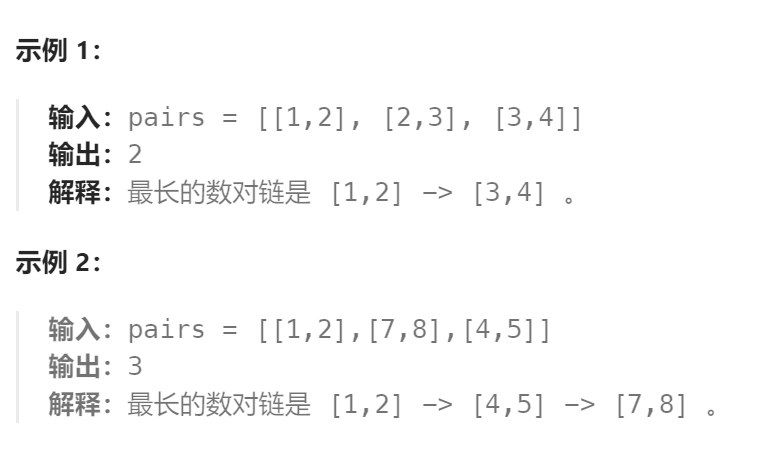

题目：

给你一个由 `n` 个数对组成的数对数组 `pairs` ，其中 `pairs[i] = [lefti, righti]` 且 `lefti < righti` 。

现在，我们定义一种 **跟随** 关系，当且仅当 `b < c` 时，数对 `p2 = [c, d]` 才可以跟在 `p1 = [a, b]` 后面。我们用这种形式来构造 **数对链** 。

找出并返回能够形成的 **最长数对链的长度** 。

你不需要用到所有的数对，你可以以任何顺序选择其中的一些数对来构造。



题解：

注意此题的示例2：

数对`[7,8]` 在数对 `[4,5]` 之前，但是在最长数对链中：`[7,8]` 可以继续延续`[1,2] -> [4,5]`。

因此，这并非一个子序列问题，而应该看作是子集问题。

```go
func findLongestChain(pairs [][]int) int {
    n := len(pairs)  // 数对的个数

    // 需要先按照 left 的大小进行升序排序（因为此题不考虑每个数对在paris中的顺序，仅要求最长的数对链）
    sort.Slice(pairs, func(i, j int) bool {
        return pairs[i][0] < pairs[j][0]
    })

    // dp[i]表示: 以第i个数对作为结尾的最长数对链的长度
    dp := make([]int, n)
    dp[0] = 1    // 以第0个数对作为结尾的最长数对链长度 == 1(只有一个数对)

    maxLen := 1
    for end:=1; end < n; end++ {
        dp[end] = 1
        for lastEnd := 0; lastEnd < end; lastEnd++ {
            if pairs[lastEnd][1] < pairs[end][0] {   // right(i-1) < left(i), 可以扩展 dp[lastEnd] 的数对链
                if dp[lastEnd] + 1 > dp[end] {
                    dp[end] = dp[lastEnd] + 1
                }
            }
        }
        if dp[end] > maxLen {
            maxLen = dp[end]
        }
    }
    return maxLen
}
```

