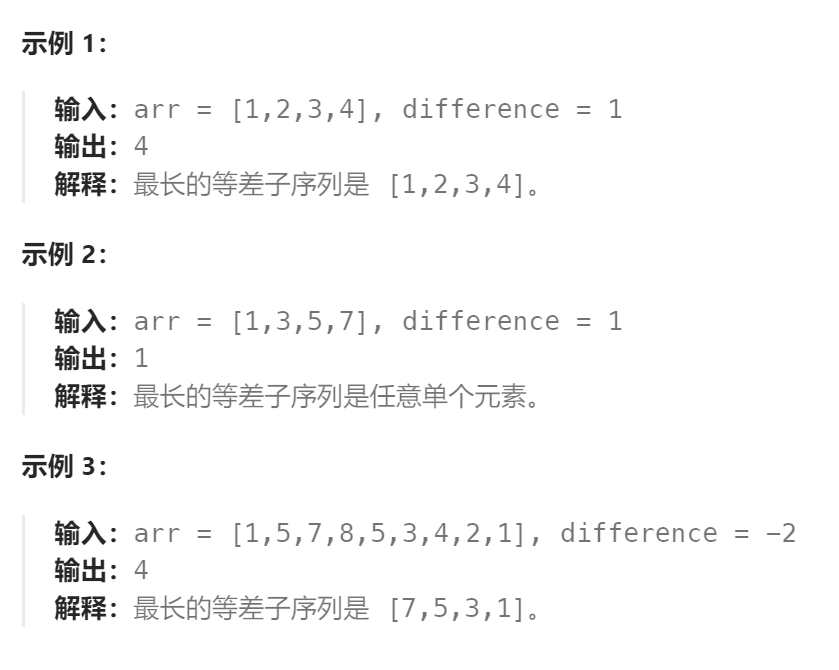
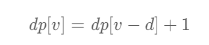

题目：

给你一个整数数组 `arr` 和一个整数 `difference`，请你找出并返回 `arr` 中最长等差子序列的长度，该子序列中相邻元素之间的差等于 `difference` 。

**子序列** 是指在不改变其余元素顺序的情况下，通过删除一些元素或不删除任何元素而从 `arr` 派生出来的序列。



题解：

### 方法一：套用最长递增子序列问题解法

此方法理论正确，但是会**超时**

```go
func longestSubsequence(arr []int, difference int) int {
    n := len(arr)

    // dp[i]表示: 以arr[i]结尾的子数组中最长等差子序列的长度
    dp := make([]int, n)
    dp[0] = 1

    maxLen := 1  // 最长等差子序列的长度
    for end := 1; end < n; end++ {
        dp[end] = 1
        for lastEnd := 0; lastEnd < end; lastEnd++ {
            if arr[end] - arr[lastEnd] == difference {  // arr[lastEnd]与arr[end]是等差关系，可以扩展
                if dp[lastEnd] + 1 > dp[end] {
                    dp[end] = dp[lastEnd] + 1
                }
            }
        }
        if dp[end] > maxLen {
            maxLen = dp[end]
        }
    }
    return maxLen
}
```

### 方法二：`dp[i]` 中 i 的意义由下标变为数值

由于我们总是**在左侧找**一个**最近的**等于 `arr[i]−d` 元素并取其对应 `dp` 值.

因此我们可以直接用 `dp[v]` 表示以**数值 `v` 为结尾**的**最长的**等差子序列的长度，这样 `dp[v−d]` 就是我们要找的左侧元素对应的最长的等差子序列的长度，因此转移方程可以改为



因为我们从左向右遍历 `arr` 数组，因此对于每一个`dp[v]` 来说都是获取左侧最近的一个`v-difference` 为结尾的子序列的最大`dp[v-difference]`

```go
func longestSubsequence(arr []int, difference int) int {
    dp := make(map[int]int)   // arr[i] 的取值范围过大，因此用map存储比较合适
    maxLen := 1
    for _, v := range arr {
        dp[v] =  getMax(dp[v], dp[v-difference] + 1) 
        if dp[v] > maxLen {
            maxLen = dp[v]
        }
    }
    return maxLen
}

func getMax(a, b int) int {
    if a > b {
        return a
    } else {
        return b
    }
}
```

