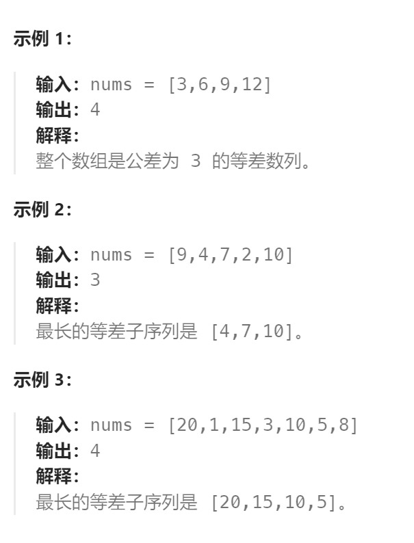
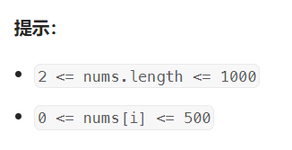

题目：

给你一个整数数组 `nums`，返回 `nums` 中最长等差子序列的**长度**。

回想一下，`nums` 的子序列是一个列表 `nums[i1], nums[i2], ..., nums[ik]` ，且 `0 <= i1 < i2 < ... < ik <= nums.length - 1`。并且如果 `seq[i+1] - seq[i]`( `0 <= i < seq.length - 1`) 的值都相同，那么序列 `seq` 是等差的。






题解：

### 方法一：沿用上一题(`dp`使用 map)

```go
func longestArithSeqLength(nums []int) int {
	// 获取数组中的最大值和最小值
	maxVal,minVal := math.MinInt, math.MaxInt
	for _,v := range nums {
        if v > maxVal {
            maxVal = v
        }
        if v < minVal {
            minVal = v
        }
	}
	// 获取最大递增差和最小递增差
	maxDiff := maxVal - minVal
	minDiff := 0 - maxDiff

	maxLen := 0
    // dp[i]: 以数值i作为结尾的最长等差数列的长度
    dp := make(map[int]int)
	// 枚举在不同递增差下，最长的等差数列长度
	for diff := minDiff; diff <= maxDiff; diff++ {
        for i := range dp {  // 每次选用不同的递增差，都要重新初始化
            dp[i] = 0
        }
        for _,v := range nums {  // 从左向右遍历 nums[], 可以获得子序列（而非子集）
            dp[v] = dp[v-diff] + 1
            if dp[v] > maxLen {
                maxLen = dp[v]
            } 
        }
	}
	return maxLen
}
```

### 方法二：`dp`改用数组

```go
func longestArithSeqLength(nums []int) int {
    // 获取数组中的最大值和最小值
    maxVal,minVal := math.MinInt, math.MaxInt
    for _,v := range nums {
        if v > maxVal {
            maxVal = v
        }
        if v < minVal {
            minVal = v
        }
    }
    // 获取最大递增差和最小递增差
    maxDiff := maxVal - minVal
    minDiff := 0 - maxDiff

    // dp[i]: 以数值i作为结尾的最长等差数列的长度
    dp := make([]int, maxVal+1) // 因为 0 <= nums[i] <= maxVal, 因此长度是 maxVal + 1

    maxLen := 0
    // 枚举在不同递增差下，最长的等差数列长度
    for diff := minDiff; diff <= maxDiff; diff++ {
        // 每次换到新的递增差，都需要将dp[]重新初始化
        for i:= range dp {   
            dp[i] = 0
        }
        for _,v := range nums {  // 从左向右遍历 nums[], 可以获得子序列（而非子集）
            // 确保每个以v结尾的子序列，其前面的数只能从当前 v 前面的 nums[i] 中获取
            // 此时在 v 后面的 nums[i] 对应的 dp[nums[i]] 都为0
            // 简单来说：prev 如果在 nums[] 中，必须确保他的坐标来自于当前 v 的坐标之前
            // 而且，对于每一种数值，仅会进行一次这样的初始化。
            if dp[v] == 0 {   // -------------------------------------------关键点
                dp[v] = 1
                // 递增差 == 0是一种特殊情况, 此时需要退出，防止针对同一个值重复让 dp[v]+1
                // 也就是说当 diff == 0时，prev == v,因此 dp[v] >=1, 自然导致dp[v] = 2
                if diff == 0 {   
                    continue
                }
            }
            prev := v - diff   // 按照差值为diff时，当前nums[i]在等差数列中前一个数字的值
            // prev可能不存在于nums[]中，dp[prev] >= 1 是 prev 存在的条件 
            if prev >= 0 && prev <= maxVal && dp[prev] >= 1 {  
                if dp[prev] + 1 > dp[v] {
                    dp[v] = dp[prev] + 1
                }
            }
            if dp[v] > maxLen {
                maxLen = dp[v]
            }
        }
    }
    return maxLen
}
```

