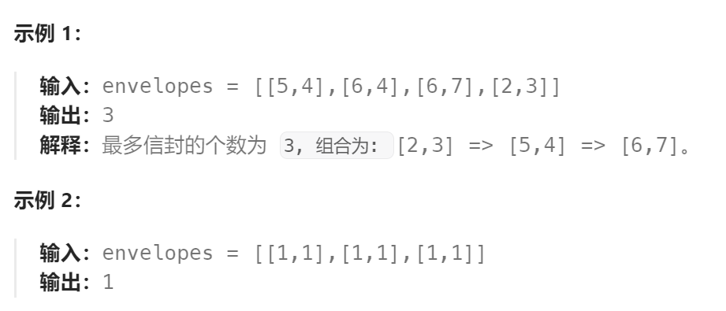

题目：

给你一个二维整数数组 `envelopes` ，其中 `envelopes[i] = [wi, hi]` ，表示第 `i` 个信封的宽度和高度。

当另一个信封的宽度和高度都比这个信封大的时候，这个信封就可以放进另一个信封里，如同俄罗斯套娃一样。

请计算 **最多能有多少个** 信封能组成一组“俄罗斯套娃”信封（即可以把一个信封放到另一个信封里面）。

**注意**：不允许旋转信封。



题解：

该问题是**二维的最长递增子序列**问题，必须先将问题降低到一维，然后再用最长递增子序列相同的处理方法进行处理。

降低维度的方法是：先将一个维度，比如 w ，进行升序排序。然后再将第二个维度，这里就是h，进行降序排序。最后针对第二个降序的维度采用最长递增子序列问题的解决方法进行处理：

- ### 方法一：动态规划

```go
func maxEnvelopes(envelopes [][]int) int {
    sort.Slice(envelopes, func(i, j int) bool {
        a, b := envelopes[i], envelopes[j]
        return a[0] < b[0] || a[0] == b[0] && a[1] > b[1]
    })
    num := len(envelopes)  // 信封的总数量
    // dp[i]：表示以envelops[i] 作为结尾信封的套娃数量
    dp := make([]int, num)
    dp[0] = 1

    maxLen := 1
    for end := 1; end < num; end++ {
        dp[end] = 1
        for lastEnd := 0; lastEnd < end; lastEnd++ {
            hJudge := (envelopes[lastEnd][1] < envelopes[end][1])   // 高度要更大
            if  hJudge {
                if dp[lastEnd] + 1 > dp[end] {
                    dp[end] = dp[lastEnd] + 1
                }
            }
        }
        if dp[end] > maxLen {
            maxLen = dp[end]
        }
    }
    return maxLen
}
```

- ### 方法二：二分查找

```go
func maxEnvelopes(envelopes [][]int) int {

    //第一步：先把宽度排好
    sort.Slice(envelopes, func(i, j int) bool {
        a, b := envelopes[i], envelopes[j]
        return a[0] < b[0] || a[0] == b[0] && a[1] > b[1]
    })
    
    //第二步：按照LIS的二分查找思路实现高度的最长递增子序列长度即可
    //使用golang内置的二分查找函数SearchInts来找到，当前数值应该插入数组的位置。
    f := []int{}
    for _, e := range envelopes {
        h := e[1]
        if i := sort.SearchInts(f, h); i < len(f) {
            f[i] = h
        } else {
            f = append(f, h)
        }
    }
    return len(f)
}
```

