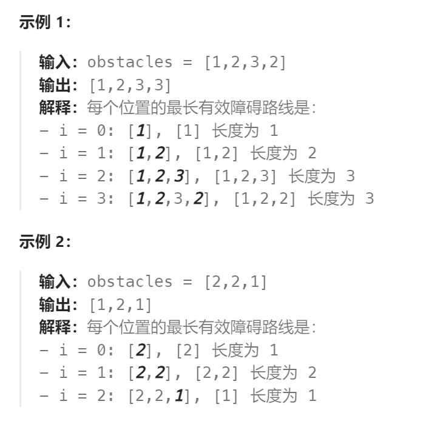

题目：

你打算构建一些障碍赛跑路线。给你一个 **下标从 0 开始** 的整数数组 `obstacles` ，数组长度为 `n` ，其中 `obstacles[i]` 表示第 `i` 个障碍的高度。

对于每个介于 `0` 和 `n - 1` 之间（包含 `0` 和 `n - 1`）的下标 `i` ，在满足下述条件的前提下，请你找出 `obstacles` 能构成的最长障碍路线的长度：

- 你可以选择下标介于 `0` 到 `i` 之间（包含 `0` 和 `i`）的任意个障碍。
- 在这条路线中，必须包含第 `i` 个障碍。
- 你必须按障碍在 `obstacles` 中的 **出现顺序** 布置这些障碍。
- 除第一个障碍外，路线中每个障碍的高度都必须和前一个障碍 **相同** 或者 **更高** 。

返回长度为 `n` 的答案数组 `ans` ，其中 `ans[i]` 是上面所述的下标 `i` 对应的最长障碍赛跑路线的长度。



题解：

**注意：此题与最长递增子序列问题有关键不同的一点，此题要求的是非严格递增，也就是当前元素可以等于上一个元素。而递增子序列问题要求的是严格递增。**

而且此题使用动态规划会超时，只能使用二分法。

### 方法一：动态规划

```go
func longestObstacleCourseAtEachPosition(obstacles []int) []int {
    n := len(obstacles)
    // dp[i]表示: 以obstacles[i]作为结尾障碍物的障碍物路线上的最大障碍物长度
    dp := make([]int, n)

    for end := 0; end < n; end++ {   // 选择结尾障碍物
        dp[end] = 1
        for lastEnd := 0; lastEnd < end; lastEnd++ {   // 遍历所有之前路线的结尾障碍物
            if obstacles[lastEnd] <= obstacles[end] {
                if dp[lastEnd] + 1 > dp[end] {   // 选择最长的障碍物路径进行扩展
                    dp[end] = dp[lastEnd] + 1
                }
            }
        }
    }
    return dp
}
```


### 方法二：二分法

```go
func longestObstacleCourseAtEachPosition(obstacles []int) []int {
    n := len(obstacles)
    // res[i]表示: 以obstacles[i]作为结尾障碍物的障碍物路线上的最大障碍物长度
    res := make([]int, n)

    curLine := []int{}   // 当前障碍物路线(记录每个选中的障碍物的高度,按照高度进行(非严格)升序的)
    // 因为当前障碍物高度可以 == 前一个障碍物高度，因此这并非一个严格递增的序列
    for end := 0; end < n; end++ {   // 选择结尾障碍物
        last := obstacles[end]   // 当前结尾障碍物的高度(题目要求: 这个障碍物必须作为路线上的最后一个障碍物)
        if len(curLine) == 0 {
            curLine = append(curLine, last)
            res[end] = len(curLine)
        } else if curLine[len(curLine) - 1] <= last {  // 比当前路线最高的障碍物相同或更高，那么可以直接作为最后一个
            curLine = append(curLine, last)
            res[end] = len(curLine)
        } else {    // 将当前障碍物设置为最后一个的同时，需要删除掉之前更大的障碍物
            // 二分法获取当前障碍物需要插入的位置, 获取 curLine[] 中 > last 的最左边界(==last不会被替换，而是可以被保留) 
            index := sort.SearchInts(curLine, last+1)  // > last 的最左边界 等价于 >= last + 1 的最左边界
            curLine[index] = last   
            res[end] = index + 1    // 必须以这个障碍物作为结尾(因此不是 == len(curLine) )， 长度 == 末尾元素下标 + 1
        }
        
    }
    return res
}
```

