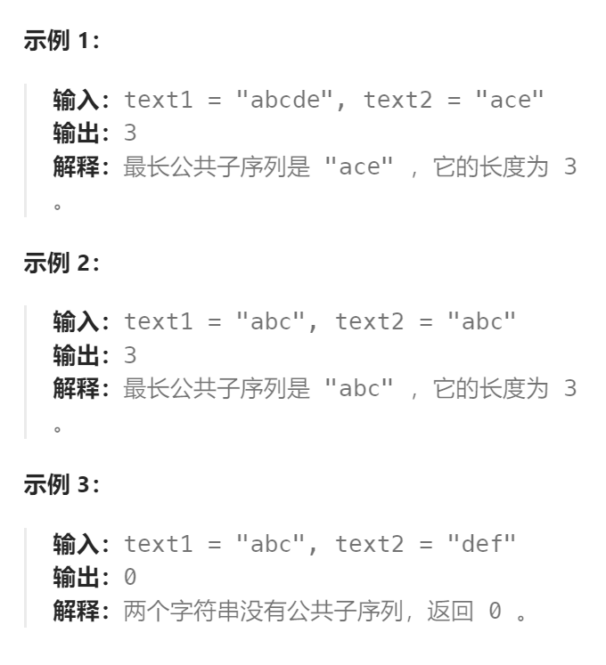

题目：

给定两个字符串 `text1` 和 `text2`，返回这两个字符串的最长 **公共子序列** 的长度。如果不存在 **公共子序列** ，返回 `0` 。

一个字符串的 **子序列** 是指这样一个新的字符串：它是由原字符串在不改变字符的相对顺序的情况下删除某些字符（也可以不删除任何字符）后组成的新字符串。

- 例如，`"ace"` 是 `"abcde"` 的子序列，但 `"aec"` 不是 `"abcde"` 的子序列。

两个字符串的 **公共子序列** 是这两个字符串所共同拥有的子序列。



题目：

```go
func longestCommonSubsequence(text1 string, text2 string) int {
    n1 := len(text1)
    n2 := len(text2)
    // dp[i][j]表示: text1[i:] 和 text2[j:] 拥有的公共子序列长度
    dp := make([][]int, n1 + 1)
    for i := range dp {
        dp[i] = make([]int, n2 + 1)
    }
    dp[n1][n2] = 0   // 此时两个都是空串，公共子序列长度 == 0
    // base case: 最后一行都是0，此时 text1 是空串
    for i := 0; i < n2; i++ {
        dp[n1][i] = 0
    }
    // base case: 最后一列都是0，此时 text2 是空串
    for i := 0; i < n1; i++ {
        dp[i][n2] = 0
    }
    for i := n1 - 1; i >= 0; i-- {
        for j := n2 - 1; j >= 0; j-- {
            if text1[i] == text2[j] {   // 该字符属于公共子序列
                dp[i][j] = dp[i+1][j+1] + 1
            } else {   // 这两个字符至少有一个字符不属于公共子序列
                // dp[i][j+1] 假定字符 text2[j] 不属于公共子序列
                // dp[i+1][j] 假定字符 text1[i] 不属于公共子序列
                // dp[i+1][j+1] 假定字符 text1[i] 和 text2[j] 都不属于公共子序列
                // 从上述三种情况中，选择能使公共子序列最长的一种情况
                dp[i][j] = getMax(dp[i][j+1], getMax(dp[i+1][j], dp[i+1][j+1]))
            }
        }
    }
    return dp[0][0]
}
func getMax(a, b int) int {
    if a > b {
        return a
    } else {
        return b
    }
}
```

