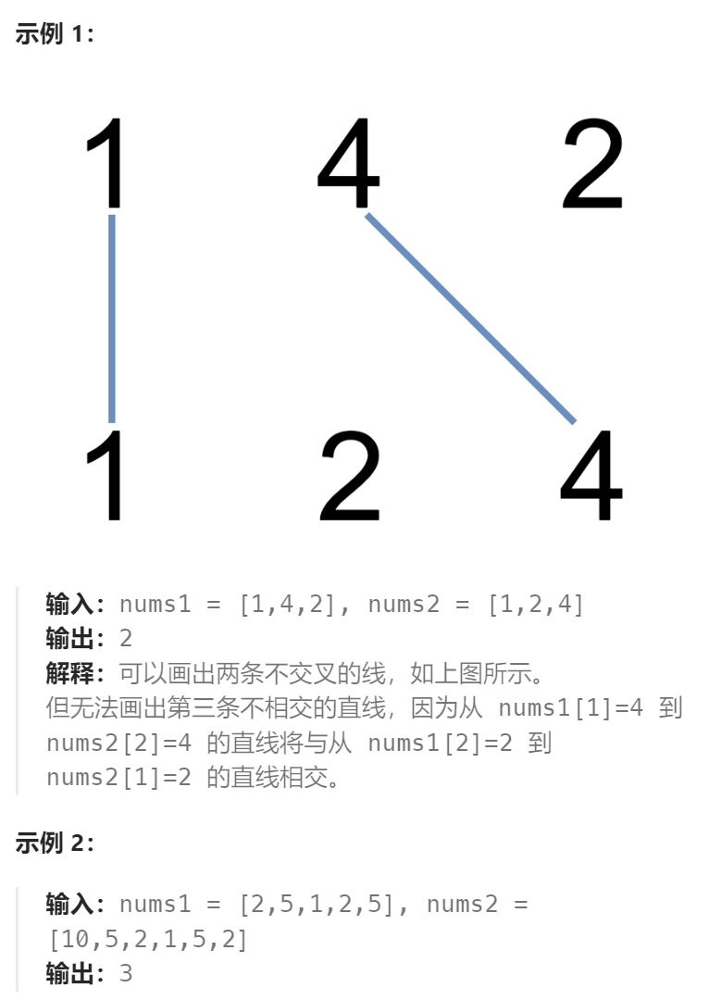

题目：

在两条独立的水平线上按给定的顺序写下 `nums1` 和 `nums2` 中的整数。

现在，可以绘制一些连接两个数字 `nums1[i]` 和 `nums2[j]` 的直线，这些直线需要同时满足满足：

-  `nums1[i] == nums2[j]`
- 且绘制的直线不与任何其他连线（非水平线）相交。

请注意，连线即使在端点也不能相交：每个数字只能属于一条连线。

以这种方法绘制线条，并返回可以绘制的最大连线数。



题解：

该题与`最长公共子序列`问题完全一致。

```go
func maxUncrossedLines(nums1 []int, nums2 []int) int {
    n1 := len(nums1)
    n2 := len(nums2)

    // dp[i][j]表示: nums1[:i] 和 nums2[:j] 可以绘制的最大连线数
    // 该题与寻找最长公共子序列是完全一样的
    dp := make([][]int, n1 + 1)
    for i := range dp {
        dp[i] = make([]int, n2 + 1)
    }
    dp[0][0] = 0   // 此时两个都是空数组，连线数 == 0
    // base case: 第一行都是0，此时 nums1[] 是空数组
    for j := 1; j <= n2; j++ {
        dp[0][j] = 0
    }
    // base case: 第一列都是0，此时 nums2[] 是空数组
    for i := 1; i <= n1; i++ {
        dp[i][0] = 0
    }

    for i := 1; i <= n1; i++ {
        for j := 1; j <= n2; j++ {
            if nums1[i-1] != nums2[j-1] {  // 如果当前两个数字不相等, 至少有一个不属于最终的公共子序列
                way1 := dp[i-1][j-1]    // 假设两个数字都不属于公共子序列
                way2 := dp[i][j-1]      // 假设 nums2[j] 不属于公共子序列
                way3 := dp[i-1][j]      // 假设 nums1[i] 不属于公共子序列
                dp[i][j] = getMax(way1, getMax(way2, way3))
            } else {   // 两个数字相等
                dp[i][j] = dp[i-1][j-1] + 1       // 这两个数字直接连线
            }
        }
    }
    return dp[n1][n2]
}

func getMax(a, b int) int {
    if a > b {
        return a
    } else {
        return b
    }
}
```

