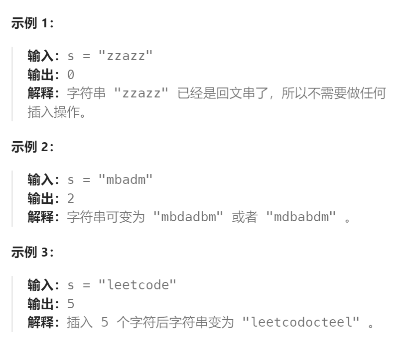

题目：

给你一个字符串 `s` ，每一次操作你都可以在字符串的任意位置插入任意字符。

请你返回让 `s` 成为回文串的 **最少操作次数** 。

「回文串」是正读和反读都相同的字符串。



题解：

```go
func minInsertions(s string) int {
    n := len(s)
    // dp[i][j]表示: 将 s[i:j] 转变为回文串所需要的最少操作次数
    dp := make([][]int, n)
    for i := range dp {
        dp[i] = make([]int, n)
    }
    // base case: i == j 时，只有一个字符就是 s[i] 本身，此时就是一个回文串，不需要操作
    for i := range dp {
        dp[i][i] = 0
    } 
    // base case: i == j-1 时，只有 s[i] 和 s[j] 两个字符，如果相等则不需要操作; 如果不相等，则需要操作一次
    for i := 0; i <= n-2; i++ {
        if s[i] == s[i+1] {
            dp[i][i+1] = 0
        } else {    // s[i] != s[i+1], 比如此时是 mb, mb要变成回文串, 要么变成 mbm，要么变成 bmb
            dp[i][i+1] = 1
        }
    }
    // 只有当 i <= j 时有效，也就是矩阵的左上区域有效
    for length := 3; length <= n; length++ {   // 枚举 s[i:j] 的长度
        for i := 0; i < n; i++ {   // 枚举子串的起点 i
            j := i + length - 1
            if j >= n {   // j越界
                break
            }
            if s[i] == s[j] {   // 左右两个字符相等，操作次数取决于 dp[i+1][j-1]
                dp[i][j] = dp[i+1][j-1]
            } else {    // 左右两个字符不相等
                // 假设 i~j-1 是回文串，在左侧加上一个s[j]变成回文串。比如 mbbma，可以在左侧加上一个a，变成ambbma
                way1 := dp[i][j-1] + 1   
                // 假设 i+1~j 是回文串，在右侧加上一个s[i]变成回文串。比如 ambbm，可以在右侧加上一个a，变成ambbma
                way2 := dp[i+1][j] + 1   
                dp[i][j] = getMin(way1, way2)   // 获取总操作次数最小的一种可能
            }
        }
    }
    return dp[0][n-1]
}
func getMin(a, b int) int {
    if a < b {
        return a
    } else {
        return b
    }
}
```

