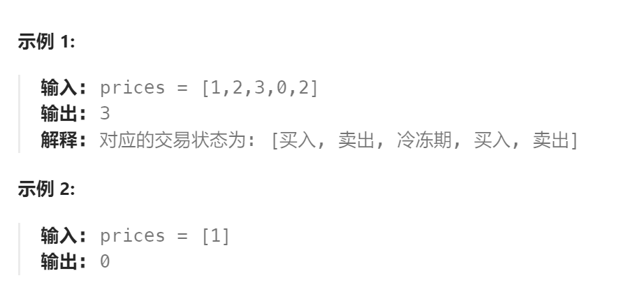

题目：

给定一个整数数组`prices`，其中第 `prices[i]` 表示第 `i` 天的股票价格 。

设计一个算法计算出最大利润。在满足以下约束条件下，你可以尽可能地完成更多的交易（多次买卖一支股票）:

- 卖出股票后，你无法在第二天买入股票 (即冷冻期为 1 天)。

**注意：**你不能同时参与多笔交易（你必须在再次购买前出售掉之前的股票）。



题解：

**注：题目给的是同一只股票的价格走势，只能是对这一只股票进行买入和卖出操作**

```go
func maxProfit(prices []int) int {
    n := len(prices)
    // dp[i][j]表示: dp[i]表示第i天结束时可以获取的最大利润
    dp := make([][]int, n)
    // dp[i][0]表示: 第i天结束后持有一只股票时的最大利润
    // dp[i][1]表示: 第i天结束后不持有任何股票，且明天会进入冷冻期时的最大利润
    // dp[i][2]表示: 第i天结束后不持有任何股票，且明天不会进入冷冻期时的最大利润
    for i := range dp {
        dp[i] = make([]int, 3)
    }
    // base case: 
    dp[0][0] = -prices[0]   // 第1天结束后要想持有一只股票，只能是在第一天买入
    dp[0][1] = 0   // 在同一天完成了买入+卖出，明天会进入了冷冻期
    dp[0][2] = 0   // 第一天什么也不干   

    for i := 1; i < n; i++ {
        // 直接继承昨天的股票，然后今天什么也不干; 昨天没股票且不会进入冷冻期，今天进行买入
        dp[i][0] = getMax(dp[i-1][0], dp[i-1][2] - prices[i])
        // 进入了冷冻期，只能是因为昨天持有股票，而今天进行了卖出
        dp[i][1] = dp[i-1][0] + prices[i]
        // 不会进入冷冻期，而且没有股票，说明买入和卖出都没有进行。而且昨天也不能有股票
        // 要么昨天就已经处于 dp[i-1][2]状态，要么是昨天卖出了股票进入了 dp[i-1][1] 状态
        dp[i][2] = getMax(dp[i-1][1], dp[i-1][2])
    }

    // 当第 n-1 天结束后，持有股票是没有意义的(只会亏损今天买股票的钱)
    // 因此 dp[n-1][0] 不可能是利润最大的情况，直接跳过
    return getMax(dp[n-1][1], dp[n-1][2])
}

func getMax(a,b int) int {
    if a > b {
        return a
    } else {
        return b
    }
}
```

