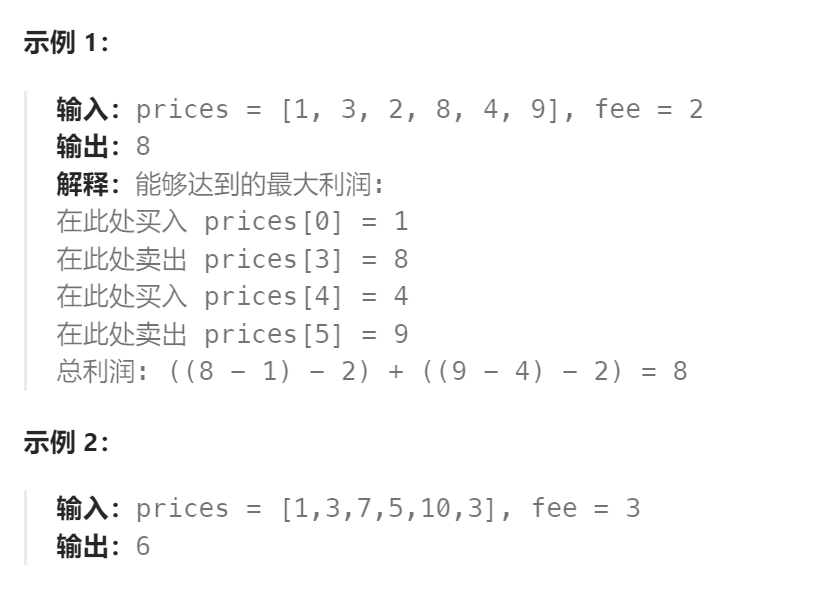

题目：

给定一个整数数组 `prices`，其中 `prices[i]`表示第 `i` 天的股票价格 ；整数 `fee` 代表了交易股票的手续费用。

你可以无限次地完成交易，但是你每笔交易都需要付手续费。如果你已经购买了一个股票，在卖出它之前你就不能再继续购买股票了。

返回获得利润的最大值。

**注意：**这里的一笔交易指买入持有并卖出股票的整个过程，每笔交易你只需要为支付一次手续费。



题解：

```go
func maxProfit(prices []int, fee int) int {
    n := len(prices)
    // dp[i]表示: 第i天结束后能获取的最大利润
    dp := make([][3]int, n)
    // dp[i][0]表示: 第i天结束后，并持有股票，获取的最大利润
    // dp[i][1]表示: 第i天结束后，不持有股票，但支付了手续费(今天进行了卖出)，能获取的最大利润
    // dp[i][2]表示: 第i天结束后，不持有股票，没有支付手续费(今天没进行卖出)，能获取的最大利润
    // base case
    dp[0][0] = - prices[0]
    dp[0][1] = -fee   // 第一天买入+卖出
    dp[0][2] = 0

    for i := 1; i < n; i++ {
        // 要么今天什么也不干, 直接继承昨天的股票; 要么昨天没有股票, 今天进行买入
        dp[i][0] = getMax(dp[i-1][0], getMax(dp[i-1][1], dp[i-1][2]) - prices[i])
        // 今天没有股票，而且进行了卖出，只能是在昨天有股票的情况下实现
        dp[i][1] = dp[i-1][0] + prices[i] - fee 
        // 今天没有股票, 而且没有进行卖出，说明昨天也没有股票
        dp[i][2] = getMax(dp[i-1][1], dp[i-1][2])
    }

    // 最后一天结束时，不能持有股票，否则不是最大利润情况
    return getMax(dp[n-1][1], dp[n-1][2])
}

func getMax(a, b int) int {
    if a > b {
        return a
    } else {
        return b
    }
}
```

