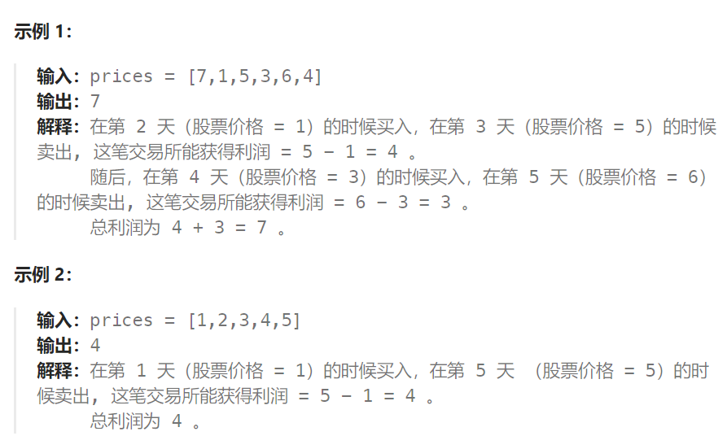

## 题目：

给你一个整数数组 `prices` ，其中 `prices[i]` 表示某支股票第 `i` 天的价格。

在每一天，你可以决定是否购买和/或出售股票。你在任何时候 **最多** 只能持有 **一股** 股票。你也可以先购买，然后在 **同一天** 出售。

返回 *你能获得的 **最大** 利润* 。



## 题解：

```go
func maxProfit(prices []int) int {
    // dp[i][0]: 第i天结束时，没有股票，可以获取的最大利润
    // dp[i][1]: 第i天结束时，有股票，可以获取的最大利润
    dp := make([][2]int, len(prices))
    dp[0][0], dp[0][1] = 0, -prices[0]
    for i := 1; i < len(prices); i++ {
        // 今天没有股票 <== 1.昨天就没有股票  2.昨天有股票, 今天卖了
        dp[i][0] = max(dp[i-1][0], dp[i-1][1] + prices[i])  
        // 今天有股票 <== 1. 昨天就有股票  2.昨天没有股票, 今天刚买
        dp[i][1] = max(dp[i-1][1], dp[i-1][0] - prices[i])  
    }
    // 最后一天肯定是没有股票利益最大
    return dp[len(prices)-1][0]
}
func max(a,b int) int{
    if a> b{
        return a
    }else{
        return b
    }
}
```

