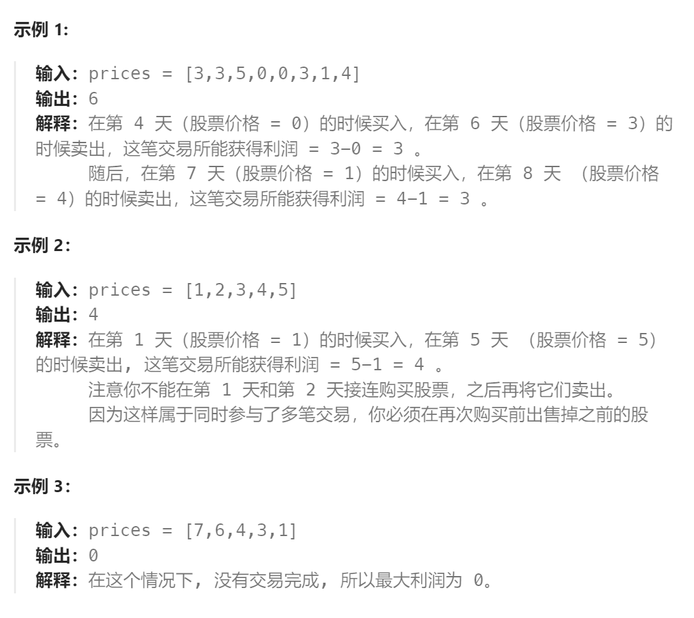

题目：

给定一个数组，它的第 `i` 个元素是一支给定的股票在第 `i` 天的价格。

设计一个算法来计算你所能获取的最大利润。你最多可以完成 **两笔** 交易。

**注意：**你不能同时参与多笔交易（你必须在再次购买前出售掉之前的股票）。



题解：

```go
func maxProfit(prices []int) int {
    n := len(prices)
    // dp[i]表示: 第 i 天结束后能获得的最大利润
    dp := make([][5]int, n)
    // dp[i][0]表示: 在第 i 天结束后拥有一只股票，且从未出售过
    // dp[i][1]表示: 在第 i 天结束后拥有一只股票，出售过1次
    // dp[i][2]表示: 在第 i 天结束后没有股票，且从未出售过
    // dp[i][3]表示: 在第 i 天结束后没有股票，出售过1次股票
    // dp[i][4]表示: 在第 i 天结束后没有股票，出售过2次股票

    // 同一天可以进行多次操作
    dp[0][0] = -prices[0]  // 第一天买入
    dp[0][1] = -prices[0]  // 第一天 买入、卖出、再买入
    dp[0][2] = 0           // 第一天什么也不干
    dp[0][3] = 0           // 第一天 买入、卖出
    dp[0][4] = 0           // 第一天 买入、卖出、再买入、再卖出

    for i := 1; i < n; i++ {
        // 这只股票的来源: 1.继承昨天已有的  2.昨天没有，今天现买的
        dp[i][0] = getMax(dp[i-1][0], dp[i-1][2] - prices[i])
        // 这只股票的来源: 1.继承昨天已有的  2.昨天没有，今天现买的
        dp[i][1] = getMax(dp[i-1][1], dp[i-1][3] - prices[i])
        // 只能是昨天也没有，而且也没有卖过
        dp[i][2] = dp[i-1][2]
        // 1.继承昨天的状态  2.昨天是 dp[i-1][0], 今天刚好卖了
        dp[i][3] = getMax(dp[i-1][3], dp[i-1][0] + prices[i])
        // 1.继承昨天的状态  2.昨天是 dp[i-1][1], 今天刚好卖了
        dp[i][4] = getMax(dp[i-1][4], dp[i-1][1] + prices[i])
    }
    // 最后一天结束了，最优解下必然不能再持有股票
    return getMax(dp[n-1][2], getMax(dp[n-1][3], dp[n-1][4]))
}

func getMax(a, b int) int {
    if a > b {
        return a
    } else {
        return b
    }
}
```

