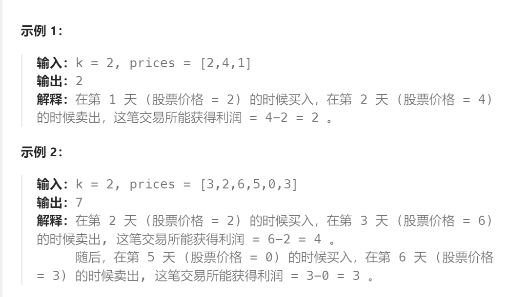

题目：

给你一个整数数组 `prices` 和一个整数 `k` ，其中 `prices[i]` 是某支给定的股票在第 `i` 天的价格。

设计一个算法来计算你所能获取的最大利润。你最多可以完成 `k` 笔交易。也就是说，你最多可以买 `k` 次，卖 `k` 次。

**注意：**你不能同时参与多笔交易（你必须在再次购买前出售掉之前的股票）。



题解：

该题与上题相比，最多交易的次数从2变成了k（1 <= k <= 100）。

但总体的思路上，没有任何变化。

- 依旧可以把第i天的状态划分为：1.有股票   2.没股票   这两种大状态
- 然后再细分。
  - 有股票的可以细分为：从未交易过、交易过一次、交易过两次、……、交易过 k - 1次（有股票情况下最多就交易k-1次）
  - 没有股票的可以细分为：从未交易过、交易过一次、交易过两次、……、交易过 k次（没有股票情况下最多就交易k次）
- 每种状态的前一种状态只有两种可能：1.继承自昨天的同一种状态   2.符合转移规律的某种已求解的状态。
- 最后，我们需要从**最后一天（第 n-1 天）没有股票**的所有状态中取出收益最大的那个。

```go
func maxProfit(k int, prices []int) int {
    n := len(prices)
    // dp[i]表示: 第 i 天结束后能获得的最大利润
    dp := make([][]int, n)
    for i := range dp {
        dp[i] = make([]int, 2*k+1)
    }
    // dp[i][0]~dp[i][k-1] 这k个元素用来存放拥有股票的情况
    // dp[i][k]~dp[i][2*k] 这k+1个元素用来存放没有股票的情况
    // base case: 拥有股票的前k个元素都是负利润买入 prices[0]
    for i:=0; i <= k-1; i++ {
        dp[0][i] = - prices[0]
    }

    for i:=1; i < n; i++ {
        // 1.先计算出第 i 天还持有股票的 k 种情况
        for j:=0; j <= k-1; j++ {
            dp[i][j] = getMax(dp[i-1][j], dp[i-1][j+k] - prices[i])
        }
        // 2.在计算出第 i 天没有持有股票的 k + 1 种情况
        dp[i][k] = dp[i-1][k]
        for j:=k+1; j <= 2*k; j++ {
            dp[i][j] = getMax(dp[i-1][j], dp[i-1][j-(k+1)] + prices[i])
        }
    }

    // 最后从没有持有股票的 k+1 种情况中获得最大利润
    maxVal := math.MinInt
    for i:=k; i <= 2*k; i++ {
        if dp[n-1][i] > maxVal {
            maxVal = dp[n-1][i]
        }
    }
    return maxVal
}

func getMax(a, b int) int {
    if a > b {
        return a
    } else {
        return b
    }
}
```


