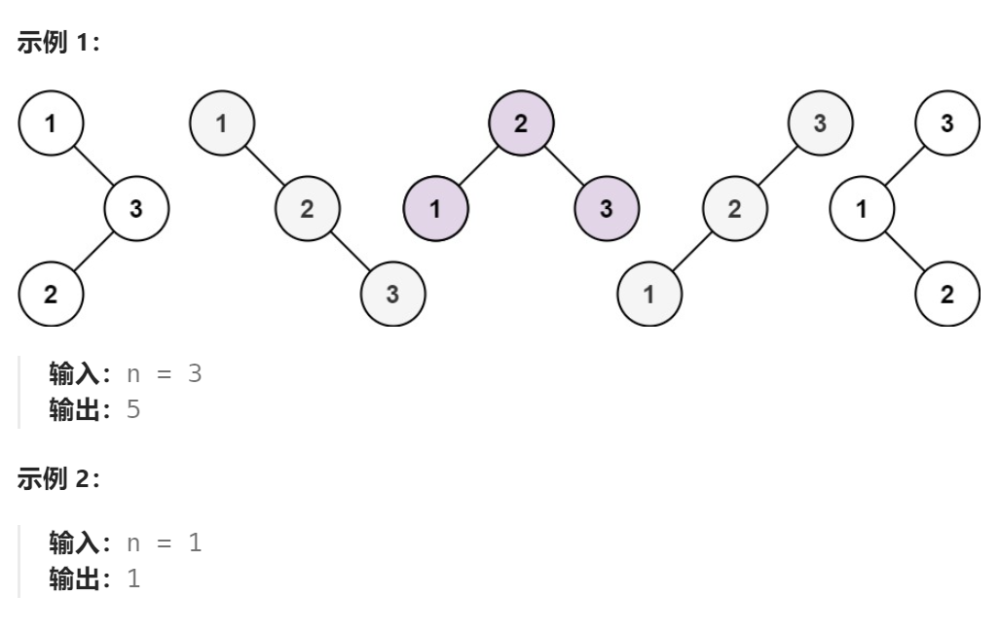
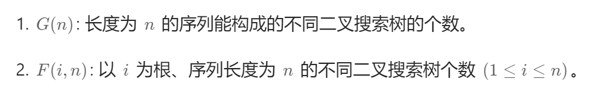
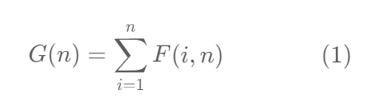
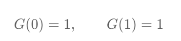
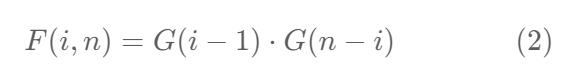
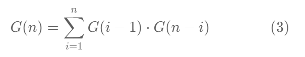

题目：

给你一个整数 `n` ，求恰由 `n` 个节点组成且节点值从 `1` 到 `n` 互不相同的 **二叉搜索树** 有多少种？返回满足题意的二叉搜索树的种数。



题解：

### 方法一：区间动态规划

```go
func numTrees(n int) int {
    // dp[i][j] 表示 i~j 范围组成的BST的数量
    // i,j 的取值范围都是 1~n (0不使用)
    dp := make([][]int, n+1)
    for i := range dp {
        dp[i] = make([]int, n+1)
    }
    // base case: i==j 时, BST只有一个节点
    for i := 1; i <=n; i++ {
        dp[i][i] = 1
    }
    // 枚举范围的长度
    for length := 2; length <= n; length++ {
        // 枚举范围的起点
        for start := 1; start <= n; start++ {
            end := start + length - 1
            if end > n {    // end 越界
                break
            }
            // 枚举 BST 的根节点
            for rootVal := start; rootVal <= end; rootVal++ {
                // 根节点 == 范围内最小值，则左子树为空
                if rootVal == start {   
                    dp[start][end] += dp[rootVal+1][end]  // 等于右子树的种数
                } else if rootVal == end {   // 右子树为空
                    dp[start][end] += dp[start][rootVal-1]
                } else {   // 左右子树都不为空
                    dp[start][end] += dp[start][rootVal-1] * dp[rootVal+1][end]
                }
            }
        }
    }
    return dp[1][n]
}
```

### 方法二：单索引动态规划

题目要求是计算不同二叉搜索树的个数。为此，我们可以定义两个函数：



可见，**G(n) 是我们求解需要的函数**。

不同的二叉搜索树的总数 G(n) ，是对遍历所有 i (1≤i≤n) 的 F(i,n) 之和，也就是说在节点数目相同的情况下，以不同的数值作为根节点。公式就是：



对于边界情况，当序列长度为 1 （只有根）或为 0 （空树）时，只有一种情况，即：



给定序列 1⋯n ，我们选择数字 i 作为根，则根为 i 的所有二叉搜索树的集合是左子树集合和右子树集合的笛卡尔积，对于笛卡尔积中的每个元素，加上根节点之后形成完整的二叉搜索树。

举例而言，**创建以 3 为根、长度为 7 的不同二叉搜索树**，整个序列是 [1,2,3,4,5,6,7] ，我们需要从左子序列 [1,2] 构建左子树，从右子序列 [4,5,6,7] 构建右子树，然后将它们组合（即笛卡尔积）。

对于这个例子，**不同二叉搜索树的个数为 F(3,7)** 。我们**将 [1,2] 构建不同左子树的数量表示为 G(2)** , 从 **[4,5,6,7] 构建不同右子树的数量表示为 G(4)** ，注意到 **G(n) 和序列的内容无关，只和序列的长度有关**。于是，F(3,7)=G(2)⋅G(4) 。 因此，我们可以得到以下公式：



将公式 (1) ，(2) 结合，可以得到 G(n) 的递归表达式：



至此，我们从小到大计算 G 函数即可，因为 **G(n) 的值依赖于 G(0)⋯G(n−1)** 。

```go
func numTrees(n int) int {
    // dp[i]表示: 长度为 i 时的BST个数
    dp := make([]int,n+1)
    // base case: 长度为0，表示的是整棵树是空树，个数为1
    dp[0] = 1   
    // base case: 长度为1，BST个数为1
    dp[1] = 1   

    // 枚举 BST 的节点数量 (2~n)
    for count := 2; count <= n; count++ { 
        // 枚举 BST 根节点的取值 (1~count)
        for root := 1; root <= count; root++ { 
            // 根节点 == root情况下
            // 左子树有 root-1个节点(1 ~ root-1)，右子树有 count-root个节点(root+1 ~ count) 
            dp[count] += dp[root-1] * dp[count-root]  
        }
    }
    // 返回长度为i时的所有BST个数
    return dp[n]
}
```

