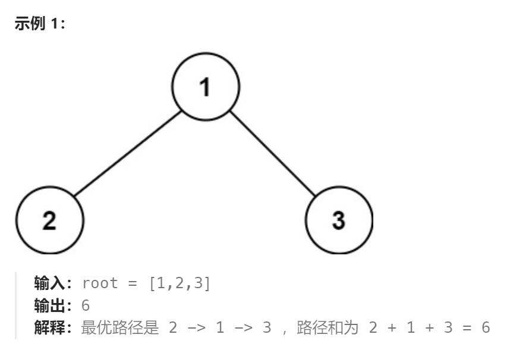
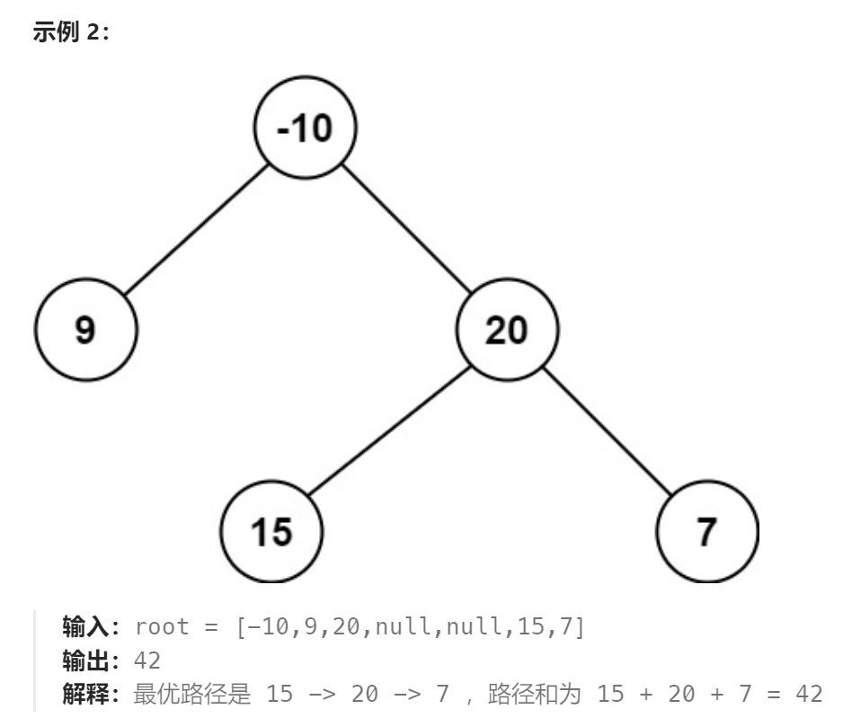

题目：

二叉树中的 **路径** 被定义为一条节点序列，序列中每对相邻节点之间都存在一条边。同一个节点在一条路径序列中 **至多出现一次** 。该路径 **至少包含一个** 节点，且不一定经过根节点。

**路径和** 是路径中各节点值的总和。

给你一个二叉树的根节点 `root` ，返回其 **最大路径和** 。





题解：

```go
/**
 * Definition for a binary tree node.
 * type TreeNode struct {
 *     Val int
 *     Left *TreeNode
 *     Right *TreeNode
 * }
 */
func maxPathSum(root *TreeNode) int {
    if root == nil {
        return 0
    }
    maxPathSum := math.MinInt  // maxPathSum用于记录递归过程中发现的最大路径和
    pathSumMap := make(map[*TreeNode]int)  // 记录以某节点为根节点的子树的最大路径和
    maxGainDP(root, &maxPathSum, pathSumMap)
    return maxPathSum
}


func maxGainDP(root *TreeNode, maxPathSum *int, pathSumMap map[*TreeNode]int) {
    if root == nil {
        return
    }
    if root.Left == nil && root.Right == nil {
        *maxPathSum = getMax(*maxPathSum, root.Val)
        pathSumMap[root] = root.Val
        return
    }
    maxGainDP(root.Left, maxPathSum, pathSumMap)
    maxGainDP(root.Right, maxPathSum, pathSumMap)

    allSum := root.Val
    leftGain := 0
    rightGain := 0
    if root.Left != nil {
        allSum += getMax(0, pathSumMap[root.Left])  
        leftGain = getMax(0, pathSumMap[root.Left])
    }
    if root.Right != nil {
        allSum += getMax(0, pathSumMap[root.Right])
        rightGain = getMax(0, pathSumMap[root.Right])
    }
    // 因为pathSumMap[root.Left]和pathSumMap[root.Right]都只取最长路径，因此这里的root的左右子树都只取单线
    *maxPathSum = getMax(*maxPathSum, allSum)  
    // 左子树和右子树只能选择一个最大的
    // 因为如果左右子树都选择，那么在这条路径上 root 将会被经过两次
    pathSumMap[root] = root.Val + getMax(leftGain, rightGain)   
}
func getMax(a,b int) int {
    if a > b {
        return a
    } else {
        return b
    }
}
```

