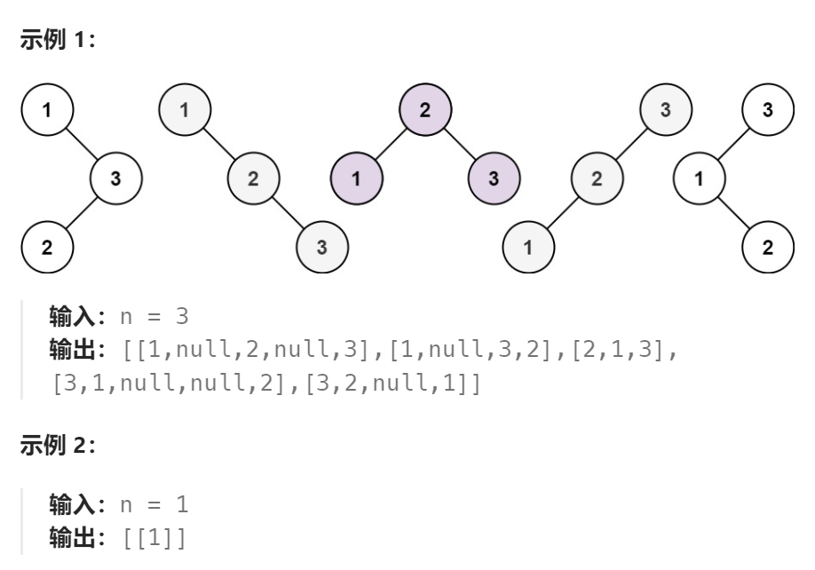

题目：

给你一个整数 `n` ，请你生成并返回所有由 `n` 个节点组成且节点值从 `1` 到 `n` 互不相同的不同 **二叉搜索树** 。可以按 **任意顺序** 返回答案。



题解：

**此题与上题的区别在于：要返回的是完整的`BST`，而不是`BST`的数量**

因此**上一题的方法二不能在此题中直接使用**，因为上一题方法二只是通过数学证明验证了计算 G(n) 的大小可以跳过 F(i,n)，两种方式在数量上是一致的。但是实际生成的子树可能不一致。

因此，我们需要用上题方法一这种**区间动态规划**：

```go
func generateTrees(n int) []*TreeNode {
    // dp[i][j]表示: 由 i~j 范围内数字组成的BST组成的数组
    // i取值范围: 1 ~ n (0不使用)
    // j取值范围: 1 ~ n (0不使用)
	dp := make([][][]*TreeNode, n+1)
	for i := 0; i < len(dp); i++ {
		dp[i] = make([][]*TreeNode, n+1)
	}
    // base case: 每个数字单独自己构成的BST，就让该数字自己做根节点
	for i := 1; i <= n; i++ {
		dp[i][i] = []*TreeNode{
			&TreeNode{i, nil, nil},
		}
	}
    // 枚举BST的长度
	for length := 2; length <= n; length++ {
        // 枚举范围的起点(BST的最小值)
		for start := 1; start <= n ; start++ {
            end := start + length - 1  // 获得范围的终点
            if end > n {   // 终点越界
                break
            }
            dp[start][end] = []*TreeNode{}
            // 枚举当前 BST 的根节点的取值
            for rootVal := start; rootVal <= end; rootVal++ {
                var leftTreeSet []*TreeNode
                if rootVal == start {    // 最小值作根节点，那么左子树为空
                    leftTreeSet = []*TreeNode{}
                } else {    // 否则，start ~ rootVal-1 范围内的数组成的BST作为左子树
                    leftTreeSet = dp[start][rootVal-1]
                }
                var rightTreeSet []*TreeNode
                if rootVal == end {  // 最大值作根节点，那么右子树为空
                    rightTreeSet = []*TreeNode{}
                } else {  // 否则，rootVal+1 ~ end 范围内的数组成的BST作为左子树
                    rightTreeSet = dp[rootVal+1][end]
                }
                if len(leftTreeSet) == 0 {  // 左子树为空
					for i := 0; i < len(rightTreeSet); i++ {
						root := &TreeNode{
							Val:   rootVal,
							Left:  nil,
							Right: nil,
						}
						root.Right = rightTreeSet[i]
						dp[start][end] = append(dp[start][end], root)
					}
                } else if len(rightTreeSet) == 0 {  // 右子树为空
					for i := 0; i < len(leftTreeSet); i++ {
						root := &TreeNode{
							Val:   rootVal,
							Left:  nil,
							Right: nil,
						}
						root.Left = leftTreeSet[i]
						dp[start][end] = append(dp[start][end], root)
					}
                } else {   // 左右子树都存在
					for i := 0; i < len(leftTreeSet); i++ {
						for j := 0; j < len(rightTreeSet); j++ {
							root := &TreeNode{
								Val:   rootVal,
								Left:  nil,
								Right: nil,
							}
							root.Left = leftTreeSet[i]
							root.Right = rightTreeSet[j]
							dp[start][end] = append(dp[start][end], root)
						}
					}
                }
            }

        }
	}

	return dp[1][n]
}
```

