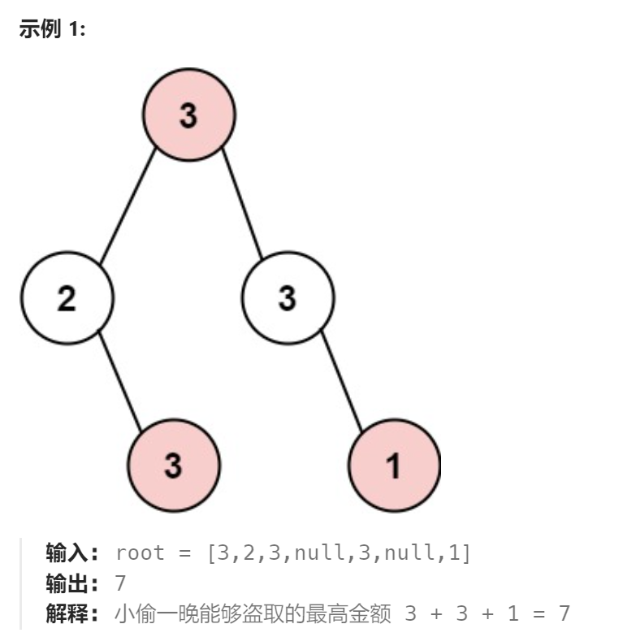

题目：

小偷又发现了一个新的可行窃的地区。这个地区只有一个入口，我们称之为 `root` 。

除了 `root` 之外，每栋房子有且只有一个“父“房子与之相连。一番侦察之后，聪明的小偷意识到“这个地方的所有房屋的排列类似于一棵二叉树”。 如果 **两个直接相连的房子在同一天晚上被打劫** ，房屋将自动报警。

给定二叉树的 `root` 。返回 ***在不触动警报的情况下** ，小偷能够盗取的最高金额* 。



题解：

这是一个**树形DP问题**，树形DP问题需要靠：二叉树递归遍历 + DP 两种方法结合来进行解决。其实就是**依靠树的递归遍历来完善 DP Table。**

```go
func rob(root *TreeNode) int {
    if root == nil {
        return 0
    }

    jieMap := make(map[*TreeNode]int)   // 记录节点被劫时,该节点对应的子树能返回的最大价值
    bujieMap := make(map[*TreeNode]int)  // 节点不被劫时,该节点对应的子树能返回的最大价值

    helperDP(root,jieMap,bujieMap)
    return getMax(jieMap[root],bujieMap[root])
}

// 动态规划问题,可以利用递归来完善使用的表
func helperDP(root *TreeNode,jieMap,bujieMap map[*TreeNode]int) {
    if root == nil {
        return 
    }
    if root.Left == nil && root.Right == nil {  // 叶子结点
        jieMap[root] = root.Val
        bujieMap[root] = 0
    }

    // 必须采用后序遍历方式来完善动态规划的两个表 jieMap和bujieMap
    // 因为父节点表项依赖于其孩子节点表象
    helperDP(root.Left,jieMap,bujieMap)
    helperDP(root.Right,jieMap,bujieMap)

    jieMap[root] = root.Val + bujieMap[root.Left] + bujieMap[root.Right]
    bujieMap[root] = getMax(jieMap[root.Left],bujieMap[root.Left]) + getMax(jieMap[root.Right],bujieMap[root.Right])

}
```

